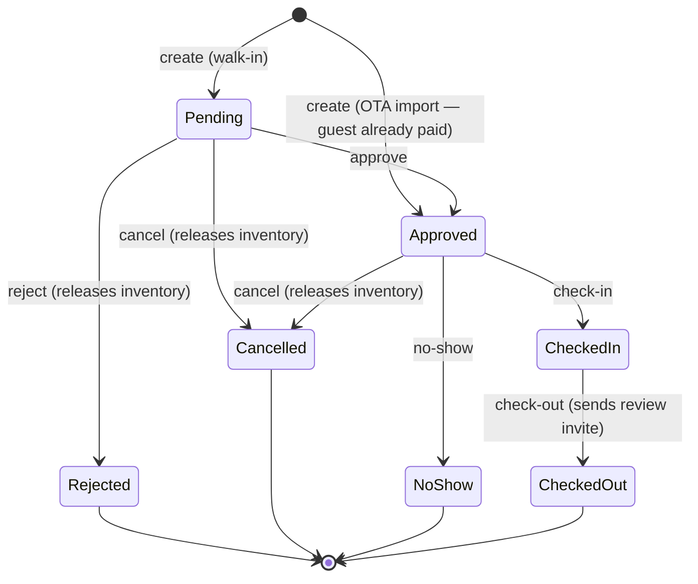

# YoHoBed 2.0 — API Reference

> Every HTTP endpoint of `apps/api` (NestJS, default `http://localhost:3001`), grouped by module,
> with auth requirements and the business rules that matter. Validation is per-route zod
> (invalid input → `400` with field details). No global route prefix.
>
> Companion docs: [ARCHITECTURE.md](ARCHITECTURE.md) (security model) ·
> [DATA-MODEL.md](DATA-MODEL.md) · [PRICING.md](PRICING.md) (the formulas behind the numbers)

**Auth legend**

| Tag        | Meaning                                                                                                                                                                                  |
| ---------- | ---------------------------------------------------------------------------------------------------------------------------------------------------------------------------------------- |
| public     | No authentication                                                                                                                                                                        |
| JWT        | `Authorization: Bearer <token>` (from `POST /auth/login`)                                                                                                                                |
| JWT+Tenant | JWT **plus** tenant resolution: the `x-tenant-id` header (or the user's single membership) must be one of the caller's memberships. Suspended/inactive tenants are rejected per-request. |
| Roles      | JWT + membership role `YOHO_STAFF` or `YOHO_ADMIN`                                                                                                                                       |
| CM-secret  | `x-cm-secret` header matching `CM_WEBHOOK_SECRET`                                                                                                                                        |
| token      | Authorization by unguessable token in the URL                                                                                                                                            |

**Common error codes**

- `400` — validation failure or an illegal state transition (message says which).
- `401` — missing/invalid credentials (login, JWT, CM secret).
- `403` — authenticated but not allowed (foreign `x-tenant-id`, owner on staff routes, suspended tenant).
- `404` — not found _or not yours_: RLS makes other tenants' rows invisible, so cross-tenant reads 404.
- `409` — conflict: `insufficient_availability` (with the failing `date`), duplicate coupon/partner/CM code, duplicate registration email.
- `422` — `unmapped_room_code` on the CM webhook (so the channel manager retries).

---

## Health

| Method & path | Auth   | Purpose                                  |
| ------------- | ------ | ---------------------------------------- |
| `GET /health` | public | Liveness: `{status:'ok', service, time}` |

## Auth (`/auth`)

| Method & path                | Auth   | Purpose                                                                                                                                                                                                                                 |
| ---------------------------- | ------ | --------------------------------------------------------------------------------------------------------------------------------------------------------------------------------------------------------------------------------------- |
| `POST /auth/login`           | public | Email + password → `{accessToken, user{memberships[+tenantStatus]}}`. Identical error for unknown email vs wrong password. Refused only if **all** the user's tenants are suspended/inactive (`pending` may sign in; staff always may). |
| `POST /auth/register`        | public | Self-serve signup: creates a **pending** tenant + OWNER user + membership + starter message templates (one transaction), sends a "registration received" email. `409` on duplicate email.                                               |
| `POST /auth/forgot-password` | public | Always answers success (no account enumeration); emails a reset link valid 60 minutes.                                                                                                                                                  |
| `POST /auth/reset-password`  | public | `{token, password}` → sets the password, invalidates all outstanding reset tokens for that email.                                                                                                                                       |
| `POST /auth/change-password` | JWT    | Requires the correct current password. Min length 8.                                                                                                                                                                                    |
| `GET /auth/me`               | JWT    | The authenticated principal `{id, email, memberships}`.                                                                                                                                                                                 |

## Properties

| Method & path           | Auth       | Purpose                                                                             |
| ----------------------- | ---------- | ----------------------------------------------------------------------------------- |
| `GET /properties`       | JWT+Tenant | List the tenant's properties.                                                       |
| `GET /properties/:id`   | JWT+Tenant | One property (404 if not yours).                                                    |
| `POST /properties`      | JWT+Tenant | Create (name). Commission model (percentage/slab) is staff-configured, default 10%. |
| `PATCH /properties/:id` | JWT+Tenant | Rename.                                                                             |

## Rooms, room types, availability (inventory)

| Method & path                                                 | Auth       | Purpose                                                                                                                                                                          |
| ------------------------------------------------------------- | ---------- | -------------------------------------------------------------------------------------------------------------------------------------------------------------------------------- |
| `GET /properties/:propertyId/rooms`                           | JWT+Tenant | Rooms of a property.                                                                                                                                                             |
| `POST /properties/:propertyId/rooms`                          | JWT+Tenant | Create room (name, physical `quantity`, optional roomtype).                                                                                                                      |
| `GET /rooms`                                                  | JWT+Tenant | All the tenant's rooms.                                                                                                                                                          |
| `PATCH /rooms/:id`                                            | JWT+Tenant | Update name/quantity/roomtype.                                                                                                                                                   |
| `GET /roomtypes` · `POST /roomtypes` · `PATCH /roomtypes/:id` | JWT+Tenant | Room-category lookup management.                                                                                                                                                 |
| `GET /rooms/:id/availability?from&to`                         | JWT+Tenant | Calendar rows (physical qty, rooms-to-sell, Open/Close, min/max stay).                                                                                                           |
| `POST /rooms/:id/availability`                                | JWT+Tenant | Open/close a date range and set rooms-to-sell (capped at the room's physical quantity). Queues a CM push + writes ARI history.                                                   |
| `POST /rooms/:id/restrictions`                                | JWT+Tenant | Set arrival-based `minStay` (1 = none) / `maxStay` (0 = unlimited) over a range. `maxStay` must be 0 or ≥ `minStay`. Queues CM push + history.                                   |
| `GET /rooms/:id/ari-history`                                  | JWT+Tenant | Last 100 ARI changes (kind availability/price/drop/restriction, date range, detail, actor email).                                                                                |
| `POST /rooms/:id/reserve` · `POST /rooms/:id/release`         | JWT+Tenant | Raw inventory adjust (the booking flow uses these internally). Reserve is atomic — `409 insufficient_availability` if any night can't supply. Release caps at physical quantity. |

## Physical rooms & assignment

`rooms` is the sellable bucket; `room_units` are the numbered rooms inside it. A booking gets one
`booking_rooms` **leg** per physical room, created unassigned — an OTA reservation has no opinion
about which room, and a walk-in is placed at the desk.

| Method & path                                   | Auth       | Purpose                                                                                                                                                                                          |
| ----------------------------------------------- | ---------- | ------------------------------------------------------------------------------------------------------------------------------------------------------------------------------------------------ |
| `GET /properties/:propertyId/room-units`        | JWT+Tenant | Every physical room, ordered by number, with the room type it belongs to.                                                                                                                        |
| `GET /properties/:propertyId/room-units/counts` | JWT+Tenant | Per room type: sellable `quantity` vs `activeUnits`/`totalUnits`. A setup warning, not an error — a room out of service legitimately makes them differ.                                          |
| `POST /properties/:propertyId/room-units`       | JWT+Tenant | Create one. **409** on a duplicate code within the property. `displayOrder` defaults to the numeric part of the code, so "07" sorts between 06 and 08.                                           |
| `PATCH /room-units/:id`                         | JWT+Tenant | Rename/renumber, set floor/notes, or take out of service. **409** when deactivating a room that still has current or future reservations.                                                        |
| `GET /bookings/:id/rooms`                       | JWT+Tenant | The booking's legs and the room each holds.                                                                                                                                                      |
| `POST /bookings/:id/assign`                     | JWT+Tenant | `{ assignments: [{ legId, roomUnitId }] }`. `roomUnitId: null` un-assigns. **409** if the room is occupied or blocked for those dates, **400** if it is a different room type or out of service. |
| `POST /bookings/:id/auto-assign`                | JWT+Tenant | Fill every unassigned leg with the lowest-numbered free room. Returns `{ assigned, unassigned, legs }` — **partial success is deliberate**, so three of four rooms still get placed.             |

Conflicts are decided by the database, not by a pre-check: an exclusion constraint on
`booking_rooms` makes an overlapping assignment impossible, closing the same race that
`rooms_to_sell >= 0` closes for buckets. Two agents assigning the last free room at the same
moment cannot both win. Half-open ranges mean a **same-day turnover is allowed**.

Cancelling or rejecting a booking releases its rooms; `NoShow` deliberately does not. Amending a
booking un-assigns its legs and re-shapes them to the new dates and room count, so the desk (or
auto-assign) places the guest again — stretching a stay into dates its current room is not free
for would otherwise fail the whole amendment.

## Stay view (the tape chart)

| Method & path                         | Auth       | Purpose                                                                                                                                                                                                         |
| ------------------------------------- | ---------- | --------------------------------------------------------------------------------------------------------------------------------------------------------------------------------------------------------------- |
| `GET /stayview?propertyId&from&to`    | JWT+Tenant | The whole chart for a date window in one request: room types -> rooms -> bars, per-date availability and rate, the metric footer, and the counted chips. `to` is exclusive; the window is capped at 120 nights. |
| `GET /properties/:propertyId/blocks`  | JWT+Tenant | Maintenance blocks on the property, including released ones.                                                                                                                                                    |
| `POST /properties/:propertyId/blocks` | JWT+Tenant | Take a room out of service. **409** if it overlaps another block, or if a guest is in the room over those dates.                                                                                                |
| `PATCH /blocks/:id`                   | JWT+Tenant | Move or re-word a block. Same conflict rules.                                                                                                                                                                   |
| `POST /blocks/:id/release`            | JWT+Tenant | "Unblock room" — puts it back in service without erasing that it was ever blocked.                                                                                                                              |

The chart is assembled server-side rather than stitched together in the browser from six endpoints:
Stay View is one dense screen and it has to feel instant. Everything is bounded by one property and
the window, so the payload stays small even for a large hotel.

**Occupancy is divided by SELLABLE rooms, not physical ones.** An eight-room property with one
blocked and five sold reads **71%** (5/7), not 63% (5/8) — reproduced exactly from Yanolja, where
the same arithmetic is visible in the screenshots. `availableInventory` follows the same rule:
`(totalRooms - blocked) - soldRooms`.

Legs with no room yet come back in a separate `unassigned` array rather than attached to a room —
Yanolja's "Default Unmapped Room" strip. `counts` is computed for the **first date** in the
window, which is the business date the user picked. There is no `dirty` count until housekeeping
lands in Sprint 4; a chip permanently reading zero would be worse than no chip.

## Reservations, groups & the registration card

| Method & path                                 | Auth       | Purpose                                                                                                                                                        |
| --------------------------------------------- | ---------- | -------------------------------------------------------------------------------------------------------------------------------------------------------------- |
| `GET /reservations?propertyId&date&tab&q`     | JWT+Tenant | One tab's rows **plus every tab's count**. Tabs: `all`, `arrivals`, `departures`, `inhouse`, `cancelled`. `q` searches reference, guest name, email and phone. |
| `GET /bookings/:id/registration-card`         | JWT+Tenant | Everything a printed GR card needs — guest, property, rooms and charges.                                                                                       |
| `POST /properties/:propertyId/booking-groups` | JWT+Tenant | Make a group from **two or more** bookings. **400** if any already belongs to a group, unless `force`.                                                         |
| `GET /booking-groups/:id`                     | JWT+Tenant | The group and its members — the Group Reservation List panel.                                                                                                  |
| `POST /booking-groups/:id/merge`              | JWT+Tenant | Add more bookings to an existing group.                                                                                                                        |
| `DELETE /bookings/:id/group`                  | JWT+Tenant | Take one booking out of its group. The group survives even if it empties.                                                                                      |

Counts come back on **every** request, not just for the active tab: the numbers are the
navigation — staff pick a tab _because_ it says 4 — and a stale count sends them to an empty
screen. One `tabFilter` defines each tab for both the counts and the rows, so the two cannot
diverge.

**Grouping never merges the money.** It writes `bookings.group_id` and nothing else; each member
keeps its own amount, folio and lifecycle. The group `total` is a presentational sum of
independent bookings, not a combined folio. That is what lets Yanolja's `3359-1` / `3359-2`
presentation exist without changing how anything is priced or settled.

`PATCH /customers/:id` records the guest depth the card and reporting need — nationality, ID type
and number, date of birth, address and the VIP flag. Every field is optional: an OTA booking
arrives with a name and little else, and demanding more would block the check-in this supports.

## Room view & housekeeping

| Method & path                                                     | Auth       | Purpose                                                                                                |
| ----------------------------------------------------------------- | ---------- | ------------------------------------------------------------------------------------------------------ |
| `GET /room-view?propertyId&date`                                  | JWT+Tenant | Every room as a card: derived state, housekeeping flag, the stay in it, VIP/balance/work-order badges. |
| `GET /house-status/summary?propertyId&date`                       | JWT+Tenant | Counts for the status chips.                                                                           |
| `POST /properties/:propertyId/housekeeping`                       | JWT+Tenant | Set a room's housekeeping state for a date. Upserts — rows are created lazily.                         |
| `POST /properties/:propertyId/housekeeping/mark-departures-dirty` | JWT+Tenant | The morning sweep: every room a guest left today becomes dirty, and no others.                         |
| `GET` / `POST /properties/:propertyId/work-orders`                | JWT+Tenant | Maintenance jobs. **Pro and above.**                                                                   |
| `PATCH /work-orders/:id`                                          | JWT+Tenant | Update or complete one. **409** on reopening a completed order. **Pro and above.**                     |

Room View and the House Status grid share one code path — they are the same data rendered two
ways, so the two screens cannot disagree about whether room 05 is dirty.

**Entitlements.** Housekeeping is in every plan; even a one-property Starter hotel has to clean
rooms. Work orders are Pro and above, so those three routes carry their own `@Feature` —
method-level metadata overrides the controller default in `EntitlementGuard`.

Every tenant has a subscription: migration `0022` grandfathers the pre-existing ones onto
Enterprise, and registration provisions a Starter trial. That matters because entitlements are
deny-by-default — a tenant with no subscription row is entitled to nothing, which was harmless
only while nothing was gated.

## Folio — the guest bill

| Method & path                                | Auth       | Purpose                                                                                                      |
| -------------------------------------------- | ---------- | ------------------------------------------------------------------------------------------------------------ |
| `GET /bookings/:id/folio`                    | JWT+Tenant | Every window, its lines, its payments and its balance. Window 1 is created on demand.                        |
| `POST /bookings/:id/folio/post-room-charges` | JWT+Tenant | Copy the room charges off the `booking_days` snapshot. **Idempotent** — returns `{posted, skipped}`.         |
| `POST /bookings/:id/folio/windows`           | JWT+Tenant | Open another window (the company bill beside the guest's).                                                   |
| `POST /folios/:id/charges`                   | JWT+Tenant | Post an extra, from the catalogue or spelled out. Anything given explicitly overrides the catalogue default. |
| `POST /folio-charges/:id/void`               | JWT+Tenant | Reverse a line. **409** if already voided.                                                                   |
| `POST /folio-charges/transfer`               | JWT+Tenant | Split the bill. **400** across bookings or into a closed window.                                             |
| `POST /folios/:id/payments`                  | JWT+Tenant | Take money against a window. Recorded in `payments`.                                                         |
| `POST /folios/:id/close?force=`              | JWT+Tenant | Close a window. **409** on a non-zero balance unless `force=true`.                                           |
| `GET /folios/unsettled?propertyId`           | JWT+Tenant | Every stay that still owes money, **in-house first**.                                                        |
| `GET` / `POST /charge-particulars`           | JWT+Tenant | The chargeable-item catalogue. **409** on a duplicate code.                                                  |

All of it is **Pro and above** — a Starter hotel gets the front desk, not the cashier.

**Room charges are copied from `booking_days`, never recomputed**, and the snapshot is per room
per night, so lines are multiplied by `bookings.rooms`. The posted lines therefore sum to
`bookings.amount` to the cent — asserted in a test, because a folio that disagrees with settlement
is the worst class of bug this system can have.

Closing refuses a non-zero balance by default: closing a bill someone still owes money on is how a
hotel loses revenue silently. `force=true` is the deliberate override for a write-off or an
externally settled balance.

Room charges are posted explicitly for now. Automatic nightly posting belongs to night audit
(Sprint 7), which is when the business date actually rolls.

## Rates & pricing

| Method & path                                                          | Auth       | Purpose                                                                                                                                                                                                          |
| ---------------------------------------------------------------------- | ---------- | ---------------------------------------------------------------------------------------------------------------------------------------------------------------------------------------------------------------- |
| `GET /rate-codes`                                                      | JWT+Tenant | Global meal-plan lookup (RO/BB/HB/FB/AI).                                                                                                                                                                        |
| `GET /rooms/:id/rate-plans` · `POST /rooms/:id/rate-plans`             | JWT+Tenant | Rate plans (room × meal plan); duplicate meal plan rejected.                                                                                                                                                     |
| `GET /rate-plans/:id/occupancies` · `POST /rate-plans/:id/occupancies` | JWT+Tenant | Guest configurations (label + accommodates 1–20).                                                                                                                                                                |
| `GET /rooms/:id/rates?from&to`                                         | JWT+Tenant | Per-date prices incl. `effectiveSelling` after any last-minute drop.                                                                                                                                             |
| `POST /occupancies/:id/price`                                          | JWT+Tenant | Set the **base** price over a range. The selling price is always derived: base → Yoho commission (slab or %) → OTA gross-up (÷0.82) → per-day tax gross-up ([PRICING.md](PRICING.md)). Queues CM push + history. |
| `POST /occupancies/:id/last-minute-drop`                               | JWT+Tenant | Set a 0–90% discount over a range (charged price = selling × (1 − drop%)). Queues CM push + history.                                                                                                             |
| `GET /properties/:id/seasons` · `POST /properties/:id/seasons`         | JWT+Tenant | Named date ranges (authoring aid; **no UI yet**).                                                                                                                                                                |
| `POST /seasons/:id/apply`                                              | JWT+Tenant | Paint base prices across the season for given occupancies.                                                                                                                                                       |

## Bookings (`/bookings`)

| Method & path                  | Auth       | Purpose                                                                                                                                                                                                                   |
| ------------------------------ | ---------- | ------------------------------------------------------------------------------------------------------------------------------------------------------------------------------------------------------------------------- |
| `GET /bookings`                | JWT+Tenant | All bookings with guest details.                                                                                                                                                                                          |
| `GET /bookings/:id`            | JWT+Tenant | One booking + per-night price snapshot (`days`) + lifecycle audit `trail`.                                                                                                                                                |
| `POST /bookings`               | JWT+Tenant | Create a walk-in. See rules below.                                                                                                                                                                                        |
| `PATCH /bookings/:id`          | JWT+Tenant | Amend: guest details in any live status; dates/rooms only while Pending/Approved — re-prices on the same occupancy and swaps inventory atomically (`409` if the new dates don't fit). Keeps the original coupon discount. |
| `POST /bookings/:id/approve`   | JWT+Tenant | Pending → Approved.                                                                                                                                                                                                       |
| `POST /bookings/:id/reject`    | JWT+Tenant | Pending → Rejected. **Releases inventory.**                                                                                                                                                                               |
| `POST /bookings/:id/cancel`    | JWT+Tenant | Pending/Approved → Cancelled. **Releases inventory.**                                                                                                                                                                     |
| `POST /bookings/:id/no-show`   | JWT+Tenant | Approved → NoShow (inventory stays consumed, matching legacy revenue treatment).                                                                                                                                          |
| `POST /bookings/:id/check-in`  | JWT+Tenant | Approved → CheckedIn (stamps `checkedInAt`).                                                                                                                                                                              |
| `POST /bookings/:id/check-out` | JWT+Tenant | CheckedIn → CheckedOut (stamps `checkedOutAt`); mints a single-use review invite and queues the review email.                                                                                                             |

**Create rules (`POST /bookings`)** — the request carries `roomId` + `occupancyId` (the pricing
key) + guest + dates + rooms + optional `couponCode`/`referralCode`:

1. The occupancy must belong to the room (fixes legacy BUG #2) — else 404/400.
2. Arrival-date min/max-stay restrictions are enforced — else 400 with the rule.
3. Every night must have a price in the rate calendar — else 400.
4. The charge is the **effective** selling price (after any last-minute drop); per-night tax is
   decomposed out for settlement.
5. Coupon: must be active, in its date window, under its usage cap, and property-compatible.
6. Inventory is reserved atomically (fixes BUG #1) — else `409 insufficient_availability`.
7. The reference comes from an atomic per-day counter (fixes BUG #4), format `yymmdd####`.
8. A CM outbox row is queued in the same transaction (fixes BUG #3).
9. The guest is reused by email or created; the owner gets a notification; a confirmation email
   is queued from the tenant's template.

**Status machine**

## Dashboard

| Method & path                    | Auth       | Purpose                                                                                                                                                                                                                                                                                                                                                                                                                           |
| -------------------------------- | ---------- | --------------------------------------------------------------------------------------------------------------------------------------------------------------------------------------------------------------------------------------------------------------------------------------------------------------------------------------------------------------------------------------------------------------------------------- |
| `GET /dashboard?date&propertyId` | JWT+Tenant | Front-desk aggregate for a date (default today): arrivals, departures, in-house count, pending approvals, occupancy % (confirmed room-nights ÷ physical rooms), month-to-view gross (from per-night snapshots, so multi-month stays land in the right month), recent bookings. `month.currency` + `month.approximate` denominate the gross: exact when scoped to one property, consolidated to LKR when it spans base currencies. |

## Commercial (deals, coupons, referrals)

| Method & path                                            | Auth       | Purpose                                                                                                                                                              |
| -------------------------------------------------------- | ---------- | -------------------------------------------------------------------------------------------------------------------------------------------------------------------- |
| `GET /properties/:id/promotions` · `POST …`              | JWT+Tenant | List/create a promotion (name, discount %, window, min nights).                                                                                                      |
| `POST /promotions/:id/apply`                             | JWT+Tenant | Push the discount onto the rate calendar (as a last-minute drop) for all the property's occupancies in the window; queues CM pushes.                                 |
| `DELETE /promotions/:id`                                 | JWT+Tenant | Remove the promotion record (already-applied calendar discounts stay until re-priced).                                                                               |
| `GET /coupons` · `POST /coupons` · `DELETE /coupons/:id` | JWT+Tenant | Guest discount codes (percentage or fixed Rs; optional property scope, window, max uses). Codes are upper-cased; duplicates 409. Redemption happens at booking time. |
| `GET /referral-partners` · `POST …` · `DELETE …/:id`     | JWT+Tenant | Partners with a code + commission %.                                                                                                                                 |
| `GET /referral-commissions`                              | JWT+Tenant | Commissions earned per booking (pending/paid).                                                                                                                       |

## Finance

| Method & path                                                | Auth       | Purpose                                                                                                                                                                                                                                                                                                                                         |
| ------------------------------------------------------------ | ---------- | ----------------------------------------------------------------------------------------------------------------------------------------------------------------------------------------------------------------------------------------------------------------------------------------------------------------------------------------------- |
| `POST /bookings/:id/invoice`                                 | JWT+Tenant | Create the booking's invoice `INV-<reference>` (idempotent — returns the existing one), lines from the per-night snapshot.                                                                                                                                                                                                                      |
| `GET /invoices` · `GET /invoices/:id`                        | JWT+Tenant | List / one with lines.                                                                                                                                                                                                                                                                                                                          |
| `POST /bookings/:id/payments` · `GET /bookings/:id/payments` | JWT+Tenant | Record/list payments (direction received/sent). Stored in the booking's currency; an optional `currency` in the body is an assertion and a mismatch is **400 `currency_mismatch`**. When received payments _in that currency_ cover the invoice, it flips to `paid`.                                                                            |
| `GET /finance/payout-statement?propertyId&from&to`           | JWT+Tenant | Settlement over confirmed bookings (Approved/CheckedIn/CheckedOut): `gross = propertyBase + yohoCommission + otaCommission + taxes`, `netPayable = propertyBase`. Reconciles to the cent by construction, exact in the property's `currency` — never FX-converted; **409 `mixed_currency_settlement`** if its bookings somehow span currencies. |
| `POST /finance/payouts` · `GET /finance/payouts`             | JWT+Tenant | Snapshot a statement as a payout record / list them.                                                                                                                                                                                                                                                                                            |
| `GET /finance/revenue?from&to`                               | JWT+Tenant | Booking counts + gross grouped by status; `approvedGross` = confirmed statuses only. Spans properties, so it returns `currency` + `approximate` — native when the tenant prices in one currency, LKR-consolidated otherwise (see PRICING.md §10).                                                                                               |

## OTA distribution

| Method & path                             | Auth          | Purpose                                                                                                                                                                                                                                                                                                                                                                                    |
| ----------------------------------------- | ------------- | ------------------------------------------------------------------------------------------------------------------------------------------------------------------------------------------------------------------------------------------------------------------------------------------------------------------------------------------------------------------------------------------ |
| `POST /cm/reservations`                   | **CM-secret** | The channel-manager webhook. Resolves the tenant **from** the room code (`422 unmapped_room_code` if unknown — the CM should retry). Idempotent on `(channel, externalRef)`. `action:'book'` records the reservation first, then imports it as an auto-approved OTA booking; a failed import keeps the row + error. `action:'cancel'` cancels the imported booking and releases inventory. |
| `GET /ota/reservations`                   | JWT+Tenant    | The owner's inbox (last 100, newest first).                                                                                                                                                                                                                                                                                                                                                |
| `POST /ota/reservations/:id/retry`        | JWT+Tenant    | Re-attempt a **failed** import (e.g. after opening availability / setting prices).                                                                                                                                                                                                                                                                                                         |
| `GET /ota/mappings` · `PUT /ota/mappings` | JWT+Tenant    | Room ↔ channel-manager code mappings. `409` if the code is taken by another room.                                                                                                                                                                                                                                                                                                          |
| `POST /ota/simulate`                      | JWT+Tenant    | Dev/demo helper: fabricates an inbound reservation for one of the tenant's mapped rooms.                                                                                                                                                                                                                                                                                                   |

## Communications

| Method & path                                                   | Auth       | Purpose                                                                |
| --------------------------------------------------------------- | ---------- | ---------------------------------------------------------------------- |
| `GET /notifications` · `GET /notifications/unread-count`        | JWT+Tenant | In-app notifications (bell).                                           |
| `POST /notifications/:id/read` · `POST /notifications/read-all` | JWT+Tenant | Mark read.                                                             |
| `GET /messages`                                                 | JWT+Tenant | Outbound email log (queued/sent/failed + error).                       |
| `GET /templates` · `PATCH /templates/:id`                       | JWT+Tenant | Per-tenant, per-language message templates (`{{placeholder}}` syntax). |
| `GET /languages`                                                | JWT+Tenant | Global language lookup (en/si/ta).                                     |

## Reviews

| Method & path                | Auth       | Purpose                                                                                                    |
| ---------------------------- | ---------- | ---------------------------------------------------------------------------------------------------------- |
| `GET /reviews/invite/:token` | **token**  | What the public review form shows (guest, property, stay, used?).                                          |
| `POST /reviews`              | **token**  | Single-use submission `{token, rating 1–5, comment?}`. Burns the invite; notifies the owner. Replay → 400. |
| `GET /reviews`               | JWT+Tenant | All reviews + per-property averages.                                                                       |

## Customers

| Method & path        | Auth       | Purpose                                                                                                                                                                                                                                                                                       |
| -------------------- | ---------- | --------------------------------------------------------------------------------------------------------------------------------------------------------------------------------------------------------------------------------------------------------------------------------------------- |
| `GET /customers`     | JWT+Tenant | Guest directory: bookings count, non-cancelled nights, confirmed spend, last check-in. `totalSpend` carries `currency` + `approximate`, folded **per guest** — a guest who stayed at properties with different base currencies gets a consolidated figure while their neighbours stay native. |
| `GET /customers/:id` | JWT+Tenant | One guest + full booking history.                                                                                                                                                                                                                                                             |

## Profile & media

| Method & path                                                                 | Auth                     | Purpose                                                    |
| ----------------------------------------------------------------------------- | ------------------------ | ---------------------------------------------------------- |
| `GET /profile`                                                                | JWT+Tenant               | User + tenant standing (incl. `pending`) + payout account. |
| `PUT /profile/payout-account`                                                 | JWT+Tenant               | Upsert the settlement bank account (one per tenant).       |
| `POST /profile/agreement/accept`                                              | JWT+Tenant               | Stamp platform-agreement acceptance (idempotent).          |
| `POST /properties/:id/photos` · `POST /rooms/:id/photos`                      | JWT+Tenant               | Multipart upload (`file`); JPEG/PNG/WebP ≤ 5 MB.           |
| `GET /properties/:id/photos` · `GET /rooms/:id/photos` · `DELETE /photos/:id` | JWT+Tenant               | List / delete.                                             |
| `GET /media/:key`                                                             | public (unguessable key) | Serve photo bytes with immutable cache headers.            |

## Staff console (`/staff`)

All routes: **Roles** (`YOHO_STAFF` / `YOHO_ADMIN`). Every action is written to the audit log.

| Method & path                                                | Purpose                                                                                                                                                                                                                                   |
| ------------------------------------------------------------ | ----------------------------------------------------------------------------------------------------------------------------------------------------------------------------------------------------------------------------------------- |
| `GET /staff/tenants`                                         | Every tenant + status + pending-booking count.                                                                                                                                                                                            |
| `GET /staff/tenants/:id/bookings`                            | A tenant's bookings (cross-tenant, still under RLS via scoped context).                                                                                                                                                                   |
| `POST /staff/tenants/:id/bookings/:bid/approve` · `…/reject` | Approve/reject on the owner's behalf.                                                                                                                                                                                                     |
| `POST /staff/tenants/:id/status`                             | Set `active` / `inactive` / `suspended`. `pending → active` sends the welcome email. Suspension blocks login and every subsequent request.                                                                                                |
| `GET /staff/tenants/:id/properties`                          | A tenant's properties with base `currency`, booking count, and `locked` (mirrors the rule below).                                                                                                                                         |
| `POST /staff/tenants/:id/properties/:pid/currency`           | Set the property's base currency (`LKR`/`USD` only). **409 `currency_locked`** once the property has bookings — their amounts are denominated in the old currency, so a change would reinterpret history. Audited as `property.currency`. |
| `GET /staff/audit`                                           | Recent audit entries (actor, action, entity, detail).                                                                                                                                                                                     |
| `POST /staff/tenants/:tenantId/plan`                         | Move a tenant onto a subscription plan by `{ planCode }`, creating the subscription if absent. **404** on an unknown code. Takes effect on the next request.                                                                              |
| `POST /staff/tenants/:tenantId/distribution-mode`            | Set `{ mode: 'yoho' \| 'standalone' }`. `standalone` zeroes the YoHo commission for that tenant's pricing.                                                                                                                                |

## Subscription plan & entitlements (`/billing`)

Yanolja's "Know Your Plan", plus the machine-readable entitlement set the web shell uses to decide
which modules to render. Gated routes elsewhere use `@Feature('…')` + `EntitlementGuard`, which
runs after `TenantGuard` and returns **403** listing the missing features.

| Method & path               | Auth       | Purpose                                                                                                                                                   |
| --------------------------- | ---------- | --------------------------------------------------------------------------------------------------------------------------------------------------------- |
| `GET /billing/plans`        | JWT        | The active catalogue, cheapest first (code, name, price, currency, feature document).                                                                     |
| `GET /billing/plan`         | JWT+Tenant | This tenant's plan, subscription state, `distributionMode` and resolved `entitlements`. A tenant with no subscription returns `plan: null`, not an error. |
| `GET /billing/entitlements` | JWT+Tenant | Just `{ features, limits }`. Every key is always present; `limits` uses `-1` for unlimited and `0` for not-included.                                      |

Entitlements are **deny-by-default**, and a `cancelled` or `past_due` subscription grants nothing.
Staff are not exempt — a YoHo staff member acting inside a tenant sees exactly what that tenant
bought, so support never demonstrates a module the customer cannot use.

## Distribution health (dev/ops)

| Method & path                     | Auth       | Purpose                                                                                |
| --------------------------------- | ---------- | -------------------------------------------------------------------------------------- |
| `GET /distribution/health`        | JWT+Tenant | Outbox status counts + recent rows for the tenant.                                     |
| `POST /distribution/test-failure` | JWT+Tenant | Enqueue a `{__fail:true}` event to exercise the retry/dead-letter path (fake adapter). |

---

## Environment variables

### apps/api (validated at boot — `src/config/env.ts`; boot fails fast on violations)

| Variable            | Default                           | Purpose                                                            |
| ------------------- | --------------------------------- | ------------------------------------------------------------------ |
| `APP_DATABASE_URL`  | — (required)                      | Postgres URL for the **restricted `yoho_app` role** (RLS applies). |
| `PORT`              | `3001`                            | HTTP port.                                                         |
| `JWT_SECRET`        | — (required, min 16 chars)        | JWT signing secret.                                                |
| `JWT_EXPIRES_IN`    | `1d`                              | Token lifetime.                                                    |
| `CM_WEBHOOK_SECRET` | dev default (min 16)              | Shared secret the channel manager sends in `x-cm-secret`.          |
| `EMAIL_PROVIDER`    | `console`                         | `console` (log only) or `resend`.                                  |
| `RESEND_API_KEY`    | —                                 | Required when provider is `resend`.                                |
| `EMAIL_FROM`        | `YoHoBed <onboarding@resend.dev>` | From address.                                                      |
| `WEB_URL`           | `http://localhost:3000`           | Base for links in emails (reset, review).                          |
| `MEDIA_DIR`         | `./uploads`                       | Photo storage directory.                                           |
| `CORS_ORIGINS`      | `http://localhost:3000`           | Comma-separated allowed origins (read in `main.ts`).               |

### apps/worker

| Variable                                                                           | Default                     | Purpose                                                                                     |
| ---------------------------------------------------------------------------------- | --------------------------- | ------------------------------------------------------------------------------------------- |
| `APP_DATABASE_URL`                                                                 | dev default                 | Same restricted role as the API.                                                            |
| `REDIS_URL`                                                                        | `redis://localhost:6380`    | BullMQ backing.                                                                             |
| `CM_PROVIDER`                                                                      | `fake`                      | `fake` \| `axisrooms` (`rategain` reserved). `axisrooms` **refuses to boot** without a URL. |
| `CM_URL_AXISROOMS`                                                                 | —                           | Base URL of the core service that owns the AxisRooms conversation.                          |
| `AXISROOMS_CHANNEL_ID`                                                             | —                           | Legacy channel id (164 in production); retained for future endpoints.                       |
| `CM_AXISROOMS_API_KEY`                                                             | —                           | Optional bearer for the core service.                                                       |
| `CM_TIMEOUT_MS`                                                                    | `15000`                     | Per-push timeout.                                                                           |
| `CM_AXISROOMS_{INVENTORY,RATE,NO_SHOW,INVENTORY_BLOCK,INVENTORY_UNBLOCK}_ENDPOINT` | `/api/axisrooms/…` defaults | Endpoint path overrides (mirror the legacy env vars).                                       |

### apps/web-extranet

| Variable              | Default                 | Purpose                            |
| --------------------- | ----------------------- | ---------------------------------- |
| `NEXT_PUBLIC_API_URL` | `http://localhost:3001` | Where the browser reaches the API. |
