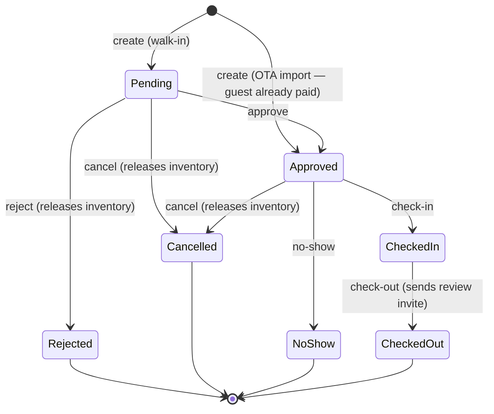

# YoHoBed 2.0 — API Reference

> Every HTTP endpoint of `apps/api` (NestJS, default `http://localhost:3001`), grouped by module,
> with auth requirements and the business rules that matter. Validation is per-route zod
> (invalid input → `400` with field details). No global route prefix.
>
> Companion docs: [ARCHITECTURE.md](ARCHITECTURE.md) (security model) ·
> [DATA-MODEL.md](DATA-MODEL.md) · [PRICING.md](PRICING.md) (the formulas behind the numbers)

**Auth legend**

| Tag        | Meaning                                                                                                                                                                                  |
| ---------- | ---------------------------------------------------------------------------------------------------------------------------------------------------------------------------------------- |
| public     | No authentication                                                                                                                                                                        |
| JWT        | `Authorization: Bearer <token>` (from `POST /auth/login`)                                                                                                                                |
| JWT+Tenant | JWT **plus** tenant resolution: the `x-tenant-id` header (or the user's single membership) must be one of the caller's memberships. Suspended/inactive tenants are rejected per-request. |
| Roles      | JWT + membership role `YOHO_STAFF` or `YOHO_ADMIN`                                                                                                                                       |
| CM-secret  | `x-cm-secret` header matching `CM_WEBHOOK_SECRET`                                                                                                                                        |
| token      | Authorization by unguessable token in the URL                                                                                                                                            |

**Common error codes**

- `400` — validation failure or an illegal state transition (message says which).
- `401` — missing/invalid credentials (login, JWT, CM secret).
- `403` — authenticated but not allowed (foreign `x-tenant-id`, owner on staff routes, suspended tenant).
- `404` — not found _or not yours_: RLS makes other tenants' rows invisible, so cross-tenant reads 404.
- `409` — conflict: `insufficient_availability` (with the failing `date`), duplicate coupon/partner/CM code, duplicate registration email.
- `422` — `unmapped_room_code` on the CM webhook (so the channel manager retries).

---

**Request references.** Every response carries `X-Request-Id` (`R-xxxxxxxx`, or a well-formed
id the caller sent). It is exposed to the browser through CORS. The web app shows it in error
messages, and the API log line for any unexpected failure starts with it. Grep the logs for the
reference a hotel quotes.

## Health

| Method & path          | Auth   | Purpose                                                                                                                                                                                                                                                                                                                                                                 |
| ---------------------- | ------ | ----------------------------------------------------------------------------------------------------------------------------------------------------------------------------------------------------------------------------------------------------------------------------------------------------------------------------------------------------------------------- |
| `GET /health`          | public | `{status: ok\|degraded\|down, checks: {database, worker, outbox}, workerSeenSecondsAgo, outbox}`. **200** whenever the database answers; `deploy.sh` relies on this. **503** only when the database is down. The worker is `degraded` after 2 minutes without a heartbeat. The outbox is `degraded` with dead letters, or with a push pending over 10 minutes. |
| `GET /health?strict=1` | public | The same body, but **503** on anything not `ok`: point an external uptime monitor here.                                                                                                                                                                                                                                                                                 |

## UX measurement (`/ux`) — UX-0

No guest data: task keys, durations, click and field counts, route **patterns**, and the app
version. See [UX-STANDARD.md §10](UX-STANDARD.md#10-measurement).

| Method & path              | Auth       | Purpose                                                                                                                                                                                                                                                                                                                          |
| -------------------------- | ---------- | -------------------------------------------------------------------------------------------------------------------------------------------------------------------------------------------------------------------------------------------------------------------------------------------------------------------------------- |
| `POST /ux/events`          | JWT+Tenant | Takes up to 50 events and answers **202** `{accepted}`. Event kinds: `task`, `client_error`, `survey_shown`, `survey_dismissed`. `task` must be a catalogue key (`reservation.quick`), never free text. Unknown keys are dropped. Ids and numbers in `route` are masked server-side. Housekeeping roles may call it. |
| `GET /ux/survey`           | JWT+Tenant | `{eligible, items}`. A person is eligible once they have 14 days at the hotel, no answer in 90 days and no "Not now" in 14.                                                                                                                                                                                                      |
| `POST /ux/survey`          | JWT+Tenant | `{answers: {easy_to_use, easy_to_learn, faster, fewer_mistakes}: 1–5, comment?}` → **201**. Every statement is required.                                                                                                                                                                                                         |
| `GET /staff/ux/scoreboard` | Roles      | `?days=1–365&tenantId?`. Returns: per task: completed, abandoned, median/p90 ms, median clicks survey: agree % and mean beside the 2025 industry baseline client crashes mistake signals: voids within 10 min, cancels within 5 min, credit notes within a day                                                       |

## Auth (`/auth`)

| Method & path                | Auth       | Purpose                                                                                                                                                                                                                                                                      |
| ---------------------------- | ---------- | ---------------------------------------------------------------------------------------------------------------------------------------------------------------------------------------------------------------------------------------------------------------------------- |
| `POST /auth/login`           | public     | Email + password → `{accessToken, user{memberships[+tenantStatus]}}`. Identical error for unknown email vs wrong password. Refused only if **all** the user's tenants are suspended/inactive (`pending` may sign in; staff always may).                                      |
| `POST /auth/register`        | public     | Self-serve signup: creates a **pending** tenant + OWNER user + membership + starter message templates (one transaction), sends a "registration received" email. `409` on duplicate email.                                                                                    |
| `POST /auth/forgot-password` | public     | Always answers success (no account enumeration); emails a reset link valid 60 minutes.                                                                                                                                                                                       |
| `POST /auth/reset-password`  | public     | `{token, password}` → sets the password, invalidates all outstanding reset tokens for that email.                                                                                                                                                                            |
| `POST /auth/change-password` | JWT        | Requires the correct current password. Min length 8.                                                                                                                                                                                                                         |
| `GET /auth/me`               | JWT        | The authenticated principal `{id, email, memberships}`.                                                                                                                                                                                                                      |
| `POST /auth/step-up`         | JWT+Tenant | An **owner** approves one over-the-limit action for the signed-in desk user: `{email, password, action: rate_override\|complimentary\|tax_exempt, reason?}` → `{approvalToken, approver, expiresAt}` (10 minutes). `403` if the credentials are not an OWNER of this tenant. |

Registration also seeds the tenant's reservation master lists (market segments, business sources,
payment methods) from the Sri Lanka preset.

**Approval tokens are not sessions.** They are signed with a key derived from `JWT_SECRET`, so one
can never be presented as a bearer token (401). Each token approves exactly one action for one
tenant and one requesting user; the services that accept it re-check all three.

## Properties

| Method & path           | Auth       | Purpose                                                                             |
| ----------------------- | ---------- | ----------------------------------------------------------------------------------- |
| `GET /properties`       | JWT+Tenant | List the tenant's properties.                                                       |
| `GET /properties/:id`   | JWT+Tenant | One property (404 if not yours).                                                    |
| `POST /properties`      | JWT+Tenant | Create (name). Commission model (percentage/slab) is staff-configured, default 10%. |
| `PATCH /properties/:id` | JWT+Tenant | Rename.                                                                             |

## Reservation configuration (Development Phase 02)

Reads are open to everyone in the tenant, including desk staff (`OWNER_STAFF`), and are **not
plan-gated** — every plan takes reservations. Writes are **owner-only** (`403` for desk staff).

| Method & path                                                    | Auth                      | Purpose                                                                                                                                                                                                                                                                                                                                                                                |
| ---------------------------------------------------------------- | ------------------------- | -------------------------------------------------------------------------------------------------------------------------------------------------------------------------------------------------------------------------------------------------------------------------------------------------------------------------------------------------------------------------------------- |
| `GET /properties/:id/reservation-config`                         | JWT+Tenant                | Everything the reservation screens need in one call: property (country, currency, timezone, check-in/out `HH:MM`), `today` (night audit's business date, else the property's calendar date), resolved settings, the five reservation kinds with their labels/colours, titles for the country, and the **active** business sources, market segments, payment methods and sales persons. |
| `PATCH /properties/:id/profile`                                  | JWT+Tenant·OWNER          | Legal name, code, address block, `countryCode` (ISO), `stateCode` (ISO for LK/MY, GST code for IN; validated against the country), timezone, check-in/out times, `taxIds` (`tin`, `ssclRegNo`, `sltdaRegNo`, `gstin`, `sstNo`, `ttxNo`, `brn`; `''` clears one), `branchCode`, `fyStartMonth`, `invoicePrefix`. **409 `country_locked`** once the property has bookings.               |
| `GET` / `PATCH /properties/:id/settings`                         | JWT+Tenant (PATCH OWNER)  | Reservation-desk settings, resolved against defaults. PATCH is a partial, deep merge: `timeFormat`, `mealCodeStyle`, `hold {defaultHours, reminderHours}`, `unconfirmedPolicy`, `rateControl {staffMaxDiscountPct, staffCanComp}`, `requireDocumentsAtCheckin`, `kindOverrides {kind: {label, color}}`, `titles`. Unknown keys → 400.                                                  |
| `GET` / `POST /business-sources` · `PATCH /business-sources/:id` | JWT+Tenant (writes OWNER) | Sources grouped by `category` (`direct/ota/travel_agent/corporate` = Yanolja's Booking Source), with `palette`, `defaultMarketSegmentId`, `commissionPlan` + `commissionValue`, `registrationNo`, `collectsTourismTax`, `sort`, `active`. Codes are upper-cased; **409** on a duplicate. Moved here from cashiering.                                                                   |
| `GET` / `POST /market-segments` · `PATCH /market-segments/:id`   | JWT+Tenant (writes OWNER) | `code`, `name`, `group` (`transient/group/contract/non_revenue`), `palette`, `excludedFromSold`, `sort`, `active`.                                                                                                                                                                                                                                                                     |
| `GET` / `POST /payment-methods` · `PATCH /payment-methods/:id`   | JWT+Tenant (writes OWNER) | `code`, `name`, `shortName`, `category` (`cash/card/bank_transfer/qr/wallet/cheque/city_ledger/online/other`), `requiresReference`, `isDefaultCash` (cash only; exactly one), `isGuestAdvance`, `currency`, `propertyId` (null = all properties).                                                                                                                                      |
| `GET` / `POST /sales-persons` · `PATCH /sales-persons/:id`       | JWT+Tenant (writes OWNER) | Ledger accounts of type `sales_person`. Phones are stored in E.164 (a local number is read in the tenant's country).                                                                                                                                                                                                                                                                   |
| `POST /configuration/apply-preset`                               | JWT+Tenant·OWNER          | `{country: LK\|MY\|IN}` → adds the preset's missing segments, sources and payment methods (matched by code; never changes existing entries). Returns the counts added.                                                                                                                                                                                                                 |

Every write re-reads the ids it references (segment, property) under the tenant's RLS context:
RLS checks the row being written, but a foreign-key check does not.

## Taking reservations (Development Phase 02)

Yanolja's Quick Reservation and Add Reservation. Open to every plan — taking a reservation is the
front desk's core job — except where a row says Pro.

| Method & path                                                      | Auth                   | Purpose                                                                                                                                                                                             |
| ------------------------------------------------------------------ | ---------------------- | --------------------------------------------------------------------------------------------------------------------------------------------------------------------------------------------------- |
| `GET /properties/:id/room-availability?checkin&checkout&residency` | JWT+Tenant             | The room grid: per room type, rooms free on **every** night, arrival min/max stay, the rate types the guest may be sold (list prices per night and for the stay) and which physical rooms are free. |
| `POST /reservations/quote`                                         | JWT+Tenant             | Price a reservation without booking it — the live Billing Summary. Same body as create; `guest` optional. Returns per-room prices, per-tax totals, `approvalsRequired`.                             |
| `POST /reservations`                                               | JWT+Tenant             | Book every room of the reservation in **one** transaction. Send `Idempotency-Key`; a retry returns the first response (`Idempotent-Replayed: true`).                                                |
| `POST /bookings/:id/confirm`                                       | JWT+Tenant             | Any unconfirmed kind → Confirm Booking. An inquiry takes its rooms now (**409** if they are gone) and goes into the room it asked for if still free.                                                |
| `POST /bookings/:id/hold`                                          | JWT+Tenant             | `{ until: ISO datetime \| null, kind? }` — put on hold, or move the release time. A confirmed booking can only become a confirmed hold.                                                             |
| `POST /bookings/:id/release-hold`                                  | JWT+Tenant             | Release a hold now: Cancelled, rooms back on sale, trail action `released`.                                                                                                                         |
| `POST /reservations/:groupId/confirm`                              | JWT+Tenant             | Confirm every live room of a multi-room reservation; all or nothing.                                                                                                                                |
| `POST /reservations/:groupId/cancel`                               | JWT+Tenant             | Cancel every room that has not arrived; all or nothing.                                                                                                                                             |
| `GET /ledger-accounts/:id/rates`                                   | JWT+Tenant, Pro        | A travel agent's or company's contract rates.                                                                                                                                                       |
| `POST /ledger-accounts/:id/rates`                                  | JWT+Tenant, Pro, owner | Add one: a room type (optionally one meal plan), a date range, and a fixed tax-inclusive nightly rate or a `discount_pct` off the list.                                                             |
| `PATCH /ledger-accounts/:id/rates/:rateId`                         | JWT+Tenant, Pro, owner | Change or deactivate one.                                                                                                                                                                           |
| `PATCH /rate-plans/:id`                                            | JWT+Tenant, owner      | `audience` (`all` \| `local` \| `foreign`), `status`, and the plan's default `marketSegmentId`.                                                                                                     |

**The request** (`POST /reservations`): `propertyId`, `checkin`, `checkout`, optional
`arrivalTime`/`departureTime` (`HH:mm`), `kind` (default `confirm`), `holdUntil`, `origin`,
`businessSourceId`, `marketSegmentId`, `salesPersonId`, `ledgerAccountId`, `voucherNo`,
`residency`, `useContractRates`, `complimentary`, `taxExempt { exemptionId, reason? }`,
`priceReason`, `approvals { rate_override?, complimentary?, tax_exempt? }`, `couponCode`,
`referralCode`, `options` (Other Information), `expectedTotal`, `groupName`, a `guest`, and 1–50
`lines`. A line is one room: `roomId`, `occupancyId` (the rate type), optional `roomUnitId`,
`adults`, `children`, `childAges`, `extraBeds`, an optional `rate` override
(`nightly` | `total` | `per_night` | `discount_pct`, tax-inclusive), and — from the full Add
Reservation page (Sprint 4) — the room's own `guest` (Guest List), `remarks` and `tasks`, and
(Sprint 5) its `inclusions` and `transfers`. With Sprint 5 the reservation also takes `billTo`
(who pays), `payment` (money taken now) and `checkIn` (a walk-in) — see
[Money at reservation](#money-at-reservation-bill-to-inclusions-and-transfers-sprint-5). At most
90 nights. The reservation-level `remarks` go on every room. A `guest` may carry `documents`
(ID type, number, expiry, visa details, how it was checked), added to their profile; an Aadhaar
number is cut to its last four digits. Tasks are work orders and need the Pro plan: a reservation
with tasks on Starter is refused with **403** and nothing is saved.

**What it creates.** One room is one booking. A reservation of N rooms is N sibling bookings
referenced `<master>-1 … <master>-n`, plus a booking group (`kind: 'reservation'`) coded with the
master reference and owned by the guest. One reservation gets one notification and one
confirmation email, and one channel-manager event per room type.

**Reservation kinds** — fixed behaviour; owners may rename and recolour them only.

| Kind             | Status   | Takes rooms | Release time                                              |
| ---------------- | -------- | ----------- | --------------------------------------------------------- |
| `confirm`        | Approved | yes         | —                                                         |
| `hold_confirm`   | Approved | yes         | default: now + the property's hold length; `null` = never |
| `hold_unconfirm` | Pending  | yes         | as above                                                  |
| `inquiry`        | Pending  | no          | —                                                         |
| `online_failed`  | Pending  | no          | —                                                         |

A booking that takes no rooms still has its leg (for pax), but it is not assigned a room — a
requested room is kept as a preference — it is drawn in Stay View's tentative lane, and it is
never counted as sold. Checking a hold in confirms it. A released hold is Cancelled with trail
action `released`.

**Price authority.** Owners are never limited. For desk staff (`OWNER_STAFF`):

- a typed rate more than the property's `rateControl.staffMaxDiscountPct` below the list needs
  approval `rate_override`;
- a complimentary reservation needs approval `complimentary` unless `staffCanComp` is on;
- a tax exemption always needs approval `tax_exempt`.

An approval is a token from `POST /auth/step-up` (the owner signs in on the desk's screen), sent
in `approvals`. Any typed rate, complimentary room or exemption also needs a `priceReason`. The
decision, the reason and the approver are stored on each booking (`pricing`) and in the audit
log. A contract rate is pre-agreed and needs neither.

**Errors**

| Status | `reason`                    | When                                                                                                                                           |
| ------ | --------------------------- | ---------------------------------------------------------------------------------------------------------------------------------------------- |
| 400    | `checkin_in_past`           | Check-in is before the hotel's business date.                                                                                                  |
| 400    | `rate_audience`             | A local or foreign rate for a guest of the other residency, or of unknown residency.                                                           |
| 400    | `price_reason_required`     | A changed price without `priceReason`.                                                                                                         |
| 403    | `approval_required`         | `actions` lists the owner approvals still needed.                                                                                              |
| 404    | —                           | Any id (room, rate, source, account, guest, property) that is not this tenant's.                                                               |
| 409    | `insufficient_availability` | `roomName`, `date` and the `lines` (0-based) that did not fit. Nothing was saved.                                                              |
| 409    | `room_taken`                | The chosen room was taken meanwhile; `line` names it. Nothing was saved.                                                                       |
| 409    | `room_blocked`              | The chosen room is under maintenance for those dates.                                                                                          |
| 409    | `guest_exists`              | A different-named guest has this email or mobile; `candidates` to pick from, or send `guest.createNew`. `line` says which room's guest it was. |
| 409    | `price_changed`             | The total differs from `expectedTotal`; `total` is the new one.                                                                                |
| 409    | `idempotency_key_reused`    | The key was used for a different body.                                                                                                         |

**Pricing.** Quote and create share one pricer (`ReservationPricer`), so the quoted total is the
stored total. A night priced from the rate calendar follows the legacy engine exactly (a golden
test pins `POST /reservations` to `POST /bookings`). See PRICING.md §12 for overrides, contract
rates, complimentary rooms and tax exemption.

## One search, and doing it in bulk (UX-2)

| Method & path                      | Auth       | Purpose                                                                                                                                                                                                         |
| ---------------------------------- | ---------- | --------------------------------------------------------------------------------------------------------------------------------------------------------------------------------------------------------------- |
| `GET /search`                      | JWT+Tenant | `?propertyId=&q=&limit=` — the whole hotel in one answer: `reservations` (any date, any status), `guests` and `rooms`, plus the hotel's `today`. Under two characters it returns nothing rather than the hotel. |
| `POST /bookings/bulk/check-in`     | JWT+Tenant | `{ ids: [1..100] }`. Each stay runs on its own transaction: `{ done, failed, results[] }`, and a refusal carries the same `reason` and sentence the single action gives.                                        |
| `POST /bookings/bulk/check-out`    | JWT+Tenant | The same, for departures.                                                                                                                                                                                       |
| `POST /bookings/bulk/assign-rooms` | JWT+Tenant | The same, auto-assigning rooms.                                                                                                                                                                                 |
| `PATCH /charge-particulars/:id`    | JWT+Tenant | Edit a catalogue charge — price, tax, or deactivate it. The code never changes; a deactivated item stays on the bills it was posted to.                                                                         |

**What the search matches.** Reference (a master reference finds every room), OTA voucher, guest
name, email, company, the room number of a guest in house, and the phone number **however either
side wrote it**: both are reduced to digits and compared on the part that survives every format,
so `0771234567` finds `+94 77 123 4567` (`phoneNeedle`, `@yohobed/domain/phone-search`). The
Reservations list search uses the same rule.

**Order.** The stay in front of the desk first: in house, then arriving, then pending, then
checked out, and within each the nearest arrival date.

## Rooms, room types, availability (inventory)

| Method & path                                                 | Auth       | Purpose                                                                                                                                                                          |
| ------------------------------------------------------------- | ---------- | -------------------------------------------------------------------------------------------------------------------------------------------------------------------------------- |
| `GET /properties/:propertyId/rooms`                           | JWT+Tenant | Rooms of a property.                                                                                                                                                             |
| `POST /properties/:propertyId/rooms`                          | JWT+Tenant | Create room (name, physical `quantity`, optional roomtype).                                                                                                                      |
| `GET /rooms`                                                  | JWT+Tenant | All the tenant's rooms.                                                                                                                                                          |
| `PATCH /rooms/:id`                                            | JWT+Tenant | Update name/quantity/roomtype.                                                                                                                                                   |
| `GET /roomtypes` · `POST /roomtypes` · `PATCH /roomtypes/:id` | JWT+Tenant | Room-category lookup management.                                                                                                                                                 |
| `GET /rooms/:id/availability?from&to`                         | JWT+Tenant | Calendar rows (physical qty, rooms-to-sell, Open/Close, min/max stay).                                                                                                           |
| `POST /rooms/:id/availability`                                | JWT+Tenant | Open/close a date range and set rooms-to-sell (capped at the room's physical quantity). Queues a CM push + writes ARI history.                                                   |
| `POST /rooms/:id/restrictions`                                | JWT+Tenant | Set arrival-based `minStay` (1 = none) / `maxStay` (0 = unlimited) over a range. `maxStay` must be 0 or ≥ `minStay`. Queues CM push + history.                                   |
| `GET /rooms/:id/ari-history`                                  | JWT+Tenant | Last 100 ARI changes (kind availability/price/drop/restriction, date range, detail, actor email).                                                                                |
| `POST /rooms/:id/reserve` · `POST /rooms/:id/release`         | JWT+Tenant | Raw inventory adjust (the booking flow uses these internally). Reserve is atomic — `409 insufficient_availability` if any night can't supply. Release caps at physical quantity. |

## Physical rooms & assignment

`rooms` is the sellable bucket; `room_units` are the numbered rooms inside it. A booking gets one
`booking_rooms` **leg** per physical room, created unassigned — an OTA reservation has no opinion
about which room, and a walk-in is placed at the desk.

| Method & path                                   | Auth       | Purpose                                                                                                                                                                                          |
| ----------------------------------------------- | ---------- | ------------------------------------------------------------------------------------------------------------------------------------------------------------------------------------------------ |
| `GET /properties/:propertyId/room-units`        | JWT+Tenant | Every physical room, ordered by number, with the room type it belongs to.                                                                                                                        |
| `GET /properties/:propertyId/room-units/counts` | JWT+Tenant | Per room type: sellable `quantity` vs `activeUnits`/`totalUnits`. A setup warning, not an error — a room out of service legitimately makes them differ.                                          |
| `POST /properties/:propertyId/room-units`       | JWT+Tenant | Create one. **409** on a duplicate code within the property. `displayOrder` defaults to the numeric part of the code, so "07" sorts between 06 and 08.                                           |
| `PATCH /room-units/:id`                         | JWT+Tenant | Rename/renumber, set floor/notes, or take out of service. **409** when deactivating a room that still has current or future reservations.                                                        |
| `GET /bookings/:id/rooms`                       | JWT+Tenant | The booking's legs and the room each holds.                                                                                                                                                      |
| `POST /bookings/:id/assign`                     | JWT+Tenant | `{ assignments: [{ legId, roomUnitId }] }`. `roomUnitId: null` un-assigns. **409** if the room is occupied or blocked for those dates, **400** if it is a different room type or out of service. |
| `POST /bookings/:id/auto-assign`                | JWT+Tenant | Fill every unassigned leg with the lowest-numbered free room. Returns `{ assigned, unassigned, legs }` — **partial success is deliberate**, so three of four rooms still get placed.             |

Conflicts are decided by the database, not by a pre-check: an exclusion constraint on
`booking_rooms` makes an overlapping assignment impossible, closing the same race that
`rooms_to_sell >= 0` closes for buckets. Two agents assigning the last free room at the same
moment cannot both win. Half-open ranges mean a **same-day turnover is allowed**.

Cancelling or rejecting a booking releases its rooms; `NoShow` deliberately does not. Amending a
booking un-assigns its legs and re-shapes them to the new dates and room count, so the desk (or
auto-assign) places the guest again — stretching a stay into dates its current room is not free
for would otherwise fail the whole amendment.

## Stay view (the tape chart)

| Method & path                         | Auth       | Purpose                                                                                                                                                                                                         |
| ------------------------------------- | ---------- | --------------------------------------------------------------------------------------------------------------------------------------------------------------------------------------------------------------- |
| `GET /stayview?propertyId&from&to`    | JWT+Tenant | The whole chart for a date window in one request: room types -> rooms -> bars, per-date availability and rate, the metric footer, and the counted chips. `to` is exclusive; the window is capped at 120 nights. |
| `GET /properties/:propertyId/blocks`  | JWT+Tenant | Maintenance blocks on the property, including released ones.                                                                                                                                                    |
| `POST /properties/:propertyId/blocks` | JWT+Tenant | Take a room out of service. **409** if it overlaps another block, or if a guest is in the room over those dates.                                                                                                |
| `PATCH /blocks/:id`                   | JWT+Tenant | Move or re-word a block. Same conflict rules.                                                                                                                                                                   |
| `POST /blocks/:id/release`            | JWT+Tenant | "Unblock room" — puts it back in service without erasing that it was ever blocked.                                                                                                                              |

The chart is assembled server-side rather than stitched together in the browser from six endpoints:
Stay View is one dense screen and it has to feel instant. Everything is bounded by one property and
the window, so the payload stays small even for a large hotel.

**Occupancy is divided by SELLABLE rooms, not physical ones.** An eight-room property with one
blocked and five sold reads **71%** (5/7), not 63% (5/8) — reproduced exactly from Yanolja, where
the same arithmetic is visible in the screenshots. `availableInventory` follows the same rule:
`(totalRooms - blocked) - soldRooms`.

Legs with no room yet come back in a separate `unassigned` array rather than attached to a room —
Yanolja's "Default Unmapped Room" strip. Bookings that hold no rooms (inquiries, failed online
bookings) come back in `tentative` — a lane of their own, never on a room and never counted as
sold (Development Phase 02). Every bar carries its `reservationKind`, a hold's `holdUntil`, and
the business source's `sourceCode` and `sourceColor` (a palette key). `counts` is computed for the **first date** in the
window, which is the business date the user picked. There is no `dirty` count until housekeeping
lands in Sprint 4; a chip permanently reading zero would be worse than no chip.

## Reservations, groups & the registration card

| Method & path                                  | Auth       | Purpose                                                                                                                                                                                                  |
| ---------------------------------------------- | ---------- | -------------------------------------------------------------------------------------------------------------------------------------------------------------------------------------------------------- |
| `GET /reservations?propertyId&date&tab&…`      | JWT+Tenant | One tab's page of rows, that tab's `total`, and **every tab's count**. Tabs: `all`, `upcoming`, `booked`, `arrivals`, `departures`, `inhouse`, `cancelled`. Paged with `limit` (≤ 200) and `offset`.     |
| `GET /reservations/export?propertyId&date&tab` | JWT+Tenant | The same filters as the list, **every page**, as CSV (UTF-8 with a byte-order mark, up to 20,000 rows). Text cells starting `=`, `+`, `-` or `@` are prefixed with `'` so a spreadsheet never runs them. |
| `GET /reservation-groups?propertyId&date&tab`  | JWT+Tenant | Group cards: `upcoming` (nobody arrived yet), `inhouse`, `departed`. Per group: dates, rooms live and total (`2 (3)`), pax, `total`, `paid`, `balance` and `averageRate` per room-night.                 |
| `POST /reservation-groups/merge`               | JWT+Tenant | `{ targetGroupId, groupIds }` — Merge Group. The target's owner stays the owner; the others are emptied and removed. **409** `group_arrived` once any room has checked in.                               |
| `GET /bookings/:id/registration-card`          | JWT+Tenant | Everything a printed GR card needs — guest, property, rooms and charges.                                                                                                                                 |
| `POST /properties/:propertyId/booking-groups`  | JWT+Tenant | Make a group from **two or more** bookings. **400** if any already belongs to a group, unless `force`.                                                                                                   |
| `GET /booking-groups/:id`                      | JWT+Tenant | The group and its members — the Group Reservation List panel.                                                                                                                                            |
| `POST /booking-groups/:id/merge`               | JWT+Tenant | Add more bookings to an existing group.                                                                                                                                                                  |
| `DELETE /bookings/:id/group`                   | JWT+Tenant | Take one booking out of its group. The group survives even if it empties.                                                                                                                                |

**List filters.** `q` searches reference (a master reference finds every room of the
reservation), voucher, guest name, email and phone (5+ digits also match the normalised mobile).
`kind` is one reservation type or `holds` (both hold kinds); `origin`, `businessSourceId`,
`marketSegmentId`, `ledgerAccountId`, `createdBy` (who took it) and `groupsOnly` narrow further.
`groupId` lists one group's rooms whatever their dates — the tab is ignored. The counts respect
every filter, so "Holds" counts only holds on each tab. `upcoming` is everything still to come
from `date` on; `booked` is what was taken on `date` in the hotel's own timezone.

**Each row** carries the pax (`adults`, `children` over its live legs), `extraGuests` and
`remarks` counts, `roomTypeName`, `rateCode`, `roomCodes`, source and segment names and codes,
`createdByName`, `voucherNo`, the arrival and departure times, and the money: `total` (room after
coupon, plus any non-room folio charges), `paid` (received less refunded) and `balance`.

Counts come back on **every** request, not just for the active tab: the numbers are the
navigation — staff pick a tab _because_ it says 4 — and a stale count sends them to an empty
screen. One `tabFilter` defines each tab for both the counts and the rows, so the two cannot
diverge.

**Grouping never merges the money.** It writes `bookings.group_id` and nothing else; each member
keeps its own amount, folio and lifecycle. The group `total` is a presentational sum of
independent bookings, not a combined folio. That is what lets Yanolja's `3359-1` / `3359-2`
presentation exist without changing how anything is priced or settled.

### A booking's guests, remarks, tasks and ID documents (Sprint 4)

| Method & path                             | Auth            | Purpose                                                                                                                                                   |
| ----------------------------------------- | --------------- | --------------------------------------------------------------------------------------------------------------------------------------------------------- |
| `GET /bookings/:id/guests`                | JWT+Tenant      | `{ primary, others }`: the guest the room is booked for and anyone else sharing it.                                                                       |
| `POST /bookings/:id/guests`               | JWT+Tenant      | Add someone sharing the room — an existing guest by `customerId`, or name/email/phone (same duplicate check as a reservation). **409** `already_primary`. |
| `DELETE /bookings/:id/guests/:customerId` | JWT+Tenant      | Take them off the booking; the guest profile stays.                                                                                                       |
| `GET` / `POST /bookings/:id/remarks`      | JWT+Tenant      | Typed notes: `general`, `front_desk`, `housekeeping`, `accounts`, `kitchen`, `preference`.                                                                |
| `DELETE /booking-remarks/:id`             | JWT+Tenant      | By the person who wrote it, or the owner (**403** otherwise).                                                                                             |
| `GET` / `POST /bookings/:id/tasks`        | JWT+Tenant, Pro | Work orders raised from the booking: `department`, `trigger` (`instant`, `checkin`, `checkout`), `deadline`, `priority`. Defaults to the guest's room.    |
| `GET` / `POST /customers/:id/documents`   | JWT+Tenant      | ID documents. The number is validated for its type (NIC, MyKad, passport…); Aadhaar keeps only its last 4 digits. One `isPrimary` per guest.              |
| `PATCH` / `DELETE /guest-documents/:id`   | JWT+Tenant      | Change or remove one. A changed type re-checks the number already stored.                                                                                 |

A task due at check-in or check-out is **waiting** until then: the work-order list returns it with
`waiting: true`, and Room View's work-order badge does not count it.

### Money at reservation, Bill To, inclusions and transfers (Sprint 5)

| Method & path                           | Auth              | Purpose                                                                                                                                                                                                                   |
| --------------------------------------- | ----------------- | ------------------------------------------------------------------------------------------------------------------------------------------------------------------------------------------------------------------------- |
| `POST /files?purpose=`                  | JWT+Tenant        | Upload a slip photo or ID scan (multipart `file`; JPEG, PNG, WebP or PDF, at most 8 MB). `purpose`: `payment_slip`, `id_document`, `other`.                                                                               |
| `GET /files/:id`                        | JWT+Tenant        | The bytes, to a member of the tenant only (`Cache-Control: private, no-store`). Another tenant's id is **404**. There is no public way in.                                                                                |
| `DELETE /files/:id`                     | JWT+Tenant        | Drop an upload that was never used. **409** once it is attached to a payment or document.                                                                                                                                 |
| `GET` / `POST /bookings/:id/inclusions` | JWT+Tenant        | What the stay includes: `name`, `rhythm` (`once`, `per_night`, `per_guest_per_night`, `per_adult_per_night`, `per_child_per_night`), tax-inclusive `unitPrice`, `discountPct`, `taxRatePct`, `includedInRate`, `itemize`. |
| `DELETE /booking-inclusions/:id`        | JWT+Tenant        | Stop one. What was already posted stays on the bill.                                                                                                                                                                      |
| `GET` / `POST /bookings/:id/transfers`  | JWT+Tenant        | Pick-ups and drop-offs: `direction`, `transportModeId`, `scheduledAt`, from/to, flight, pax, vehicle, driver, tax-inclusive `amount`.                                                                                     |
| `PATCH /booking-transfers/:id`          | JWT+Tenant        | Change one, or its `status`: `done` posts its charge to the window that takes extras; `cancelled` voids that charge. A done transfer's price is locked (**409**).                                                         |
| `GET /transport-modes`                  | JWT+Tenant        | The vehicles (seeded per country: car, van, SUV, coach, plus tuk-tuk in LK and auto-rickshaw in IN).                                                                                                                      |
| `POST` / `PATCH /transport-modes[/:id]` | JWT+Tenant, owner | Add or change one: `code`, `name`, `defaultPrice`, `sort`, `active`.                                                                                                                                                      |

**Money taken with the reservation** (`payment: { paymentMethodId, amount, reference?, fileId?,
drawerSessionId? }`). The method is one of the hotel's own (`payment_methods`); its category maps
onto the payments ledger's four (`cash`, `card`, `bank`, `online`), so the cashier report and payout
keep adding up. A method marked `requiresReference` without one is **400** `reference_required`; more
than the reservation's total is **400** `payment_exceeds_total`. Cash goes into the open drawer shift
(the user's own, else the latest); with the cashiering feature on, no open shift is **409**
`drawer_closed` — on Starter cash is taken without a till. A multi-room deposit is split across the
rooms in proportion to their prices (remainders to the largest), under **one receipt number**
(`RC<yy>-<nnnnn>`, gap-free per property and year) and one `allocation_group_id`. The City Ledger
method (Pro) charges the reservation's travel agent or company instead: a payment plus a ledger
debit, with the account's credit limit enforced. Any failure saves nothing.

**Bill To** (`billTo`, default `guest`) sets who each room's bill (window 1) bills:

| `billTo`           | Window 1 payer                         | Window 2                                                        |
| ------------------ | -------------------------------------- | --------------------------------------------------------------- |
| `guest`            | the room's guest                       | —                                                               |
| `group_owner`      | the reservation's guest, on every room | —                                                               |
| `company`          | the travel agent or company (Pro)      | —                                                               |
| `company_room_tax` | the travel agent or company (Pro)      | "Guest (extras)": manual, POS and inclusion charges route there |

Room charges always post to window 1. Night audit (and a completed transfer) post extras to the
window whose `routes` include their source.

**Walk-in** (`checkIn: true`). Only a `confirm` or `hold_confirm` reservation whose check-in is the
property's business date (**400** `checkin_not_today`). A line without a room gets the lowest free
room of its type (**409** `no_room_free`); a room marked dirty today is allowed, with a warning. All
rooms are checked in in the same transaction. The response adds `status: 'CheckedIn'`,
`checkedIn`, `billTo`, `payment { receiptNo, amount, method }` and `warnings`.

**At check-out** (Pro): a window billed to a travel agent or company moves its balance to that
account (a ledger debit; the credit limit is not enforced — the guest is leaving), and a travel
agent with a commission plan is credited its commission once, on room revenue net of tax:
`pct_all_nights`, `pct_first_night`, `fixed_per_night` or `fixed_per_stay`.

**Inclusions** post at night audit for guests actually in the house (`CheckedIn`), to the window
routed for `inclusion`: `once` on the first night only, the per-guest rhythms by the legs' pax,
tax decomposed out of the inclusive price. One posting per inclusion per night (a partial unique
index backs it up). An `includedInRate` inclusion is never posted.

The registration card honours the reservation's Other Information: with "Suppress rate on
registration card" the money is left off (`amount` and `taxes` are null, `rateSuppressed` true), and
the card lists what the stay includes.

`PATCH /customers/:id` records the guest depth the card and reporting need — nationality, ID type
and number, date of birth, address and the VIP flag — plus the regional profile of Development
Phase 02: title, given/family name, WhatsApp, ISO nationality and country codes, state, zip,
gender, occupation, company and tax number, and privacy consent (`consentVersion`; the server
stamps the time). A phone is stored as typed and normalised to `mobileE164`. Every field is optional: an OTA booking
arrives with a name and little else, and demanding more would block the check-in this supports.

### Invoices, pro-formas and credit notes (Sprint 6)

| Method & path                                             | Auth              | Purpose                                                                                                                                                        |
| --------------------------------------------------------- | ----------------- | -------------------------------------------------------------------------------------------------------------------------------------------------------------- |
| `POST /folios/:id/invoice`                                | JWT+Tenant        | Invoice a folio window. Body: an optional `payer` (what the desk types at the counter — a company's name and tax number) and `notes`. Returns `{ documents }`. |
| `POST /bookings/:id/invoices`                             | JWT+Tenant        | The same, from the booking: opens window 1 if the stay never had one, and bills the booking's own nights when no room charge was ever posted.                  |
| `POST /bookings/:id/proforma`                             | JWT+Tenant        | What the stay will cost — nights, inclusions by their rhythm, transfers booked. Its own series; never a tax document.                                          |
| `POST /invoices/:id/credit-note`                          | JWT+Tenant        | Cancel an invoice. `reason` required. **409** `already_credited`; **400** `not_creditable` for a pro-forma or the legacy invoice.                              |
| `GET /invoices?propertyId&bookingId&folioId&kind&from&to` | JWT+Tenant        | The documents issued, newest first.                                                                                                                            |
| `GET /invoices/:id`                                       | JWT+Tenant        | One document with its lines, its payer and supplier snapshots, its taxes, and the credit notes against it.                                                     |
| `GET /properties/:id/document-sequences`                  | JWT+Tenant        | Each series and what the next document of each kind would be numbered today.                                                                                   |
| `PATCH /properties/:id/document-sequences`                | JWT+Tenant, owner | Continue a series from another system: `{ docType, period, nextValue }`. Forward only — **409** `sequence_backwards`.                                          |

Ungated: every hotel that sells a room has to invoice it.

**What is issued.** A folio window is invoiced **once** — a partial unique index allows one live
document of each folio kind per window, and a second attempt is **409** `already_invoiced`. An
issued document is never edited or voided; a credit note cancels it (stamping `credited_at`), and
the window can then be invoiced again. An empty window is **400** `nothing_to_invoice`.

**Sri Lanka (Gazette 2481/22).** A hotel in Sri Lanka with a TIN gets profile `lk_vat`: the
VAT-able lines go on a **TAX INVOICE** and everything else on a **BILL**, because the gazette allows
only VAT-able supplies on a tax invoice. The serial is `YYMMM-QQQQ-n` (year, month, branch code,
the month's running number), at most 40 characters; dates print MM/DD/YYYY; a foreign-currency
invoice carries the LKR equivalent at the invoice date's rate (**409** `fx_rate_unavailable` with no
rate). Anyone else gets one **INVOICE** numbered `<prefix>-<fiscal year>-00001`.

**Where the numbers come from.** `document_sequences`, per property, document type and period — a
month for Sri Lankan tax invoices (the serial carries it), the fiscal year for everything else.
The number is taken inside the issuing transaction, so a failure gives it back and the series stays
gap-free. Credit notes and pro-formas have their own series.

**What a line carries.** Room lines take their per-tax split from `booking_days.tax_lines` scaled to
the rooms, so an invoice's taxes add up to the stored tax to the cent. Any other charge with tax
gets one line at its own rate. `net + tax = amount` on every line, and `subtotal + tax_total +
rounding = amount` on the document.

The pre-Phase-02 `POST /bookings/:id/invoice` (`INV-<reference>`, one per booking) is untouched and
still idempotent; it is `kind: 'legacy'`.

### The booking voucher and the guest booking page (Sprint 6)

| Method & path                            | Auth       | Purpose                                                                                                                                  |
| ---------------------------------------- | ---------- | ---------------------------------------------------------------------------------------------------------------------------------------- |
| `POST /reservations/:id/voucher/preview` | JWT+Tenant | The voucher as it will be sent: subject, body, default recipients, the WhatsApp click-to-chat link, and the guest link if one is open.   |
| `POST /reservations/:id/voucher/send`    | JWT+Tenant | `{ emails: [1..10] }` — **one message per address**, never one addressed to many. Queued in the transaction, delivered after it commits. |
| `POST /reservations/:id/voucher/link`    | JWT+Tenant | The guest page link: the live one, or a new one. Making it turns "Access to guest portal" on for the reservation.                        |
| `DELETE /reservations/:id/voucher/link`  | JWT+Tenant | Close the page. The link answers 404 from then on.                                                                                       |
| `GET /public/vouchers/:token`            | **public** | The guest booking page. `X-Robots-Tag: noindex`, `Cache-Control: no-store`.                                                              |

The voucher covers the **whole reservation** — every sibling room of a multi-room booking, under its
master reference. `voucher_tokens` has no RLS, like `review_invites`: a guest has no tenant context,
so the unguessable token is the authorization and resolves the tenant; everything the page shows is
then read under that tenant's RLS. An unknown, revoked or expired token is the same 404, so a guess
learns nothing. The page shows the stay, the money and the hotel — never the guest's email, phone or
documents, and only their first name.

A reservation with "Email booking vouchers" sends the voucher to the addresses it names when it is
created, in place of the plain confirmation to those addresses. "Send email at check-out" sends the
`checkout_thank_you` template (or the reservation's chosen one) when the guest leaves.

### Malaysia and India: taxes, levies, Form C (Sprint 7)

| Method & path                             | Auth             | Purpose                                                                                                                                                                                                                                                                               |
| ----------------------------------------- | ---------------- | ------------------------------------------------------------------------------------------------------------------------------------------------------------------------------------------------------------------------------------------------------------------------------------- |
| `GET /properties/:id/taxes`               | JWT+Tenant       | The property's tax engine (`taxMode`), its taxes with their rates and slabs, its levies, and whether its country preset is available / switched on / applied.                                                                                                                         |
| `POST /properties/:id/taxes/apply-preset` | JWT+Tenant·OWNER | Apply the country's tax set-up (Malaysia: SC + SST + Tourism Tax + guest register; India: GST slabs) and re-price the calendar from today. **409** `region_not_enabled` until the platform switches the country on; **409** `currency_mismatch`; **400** `no_tax_preset` (Sri Lanka). |
| `GET /bookings/:id/registration`          | JWT+Tenant       | The stay's journey details, its Form C status and due time, and what Malaysia's guest register still lacks.                                                                                                                                                                           |
| `PUT /bookings/:id/registration`          | JWT+Tenant       | `{ arrivedFrom?, arrivedInCountryOn?, portOfEntry?, nextDestination?, purposeOfVisit? }`.                                                                                                                                                                                             |
| `POST /bookings/:id/form-c`               | JWT+Tenant       | `{ reference, submittedAt? }` — Form C was filed on the Bureau of Immigration portal. **400** `form_c_not_required` for a guest who does not need it.                                                                                                                                 |
| `GET /properties/:propertyId/form-c`      | JWT+Tenant       | India's Form C work list: foreign guests checked in over the last 14 days, each with `dueAt` (check-in + 24 h), `hoursLeft`, `overdue` and the filing reference. `{ required: false }` elsewhere.                                                                                     |

- **Forward pricing.** An `exclusive_forward` property prices from `rate_calendar.net_price`; a
  typed rate, contract rate or discount is **before tax**, and `POST /reservations/quote` says so
  (`taxMode`). The quote also returns `levies`: the tourism tax the stay will owe on top.
- **Levies on the folio.** Levy lines are `source: 'levy'` with a `levyCode`. Night audit posts
  them for in-house guests, and `check-out` reconciles them to the nights stayed. Undoing a
  check-in voids them. `POST /folio-charges/transfer` moves every line of a levy together.
- **Invoices.** An Indian hotel with a GSTIN on the forward engine issues `profile: 'in_gst'` TAX
  INVOICEs, and a Malaysian one with an SST number issues `my_sst`. **400** `invalid_gstin` when a
  buyer GSTIN is not one.
- **Check-in.** With `requireGuestRegistration` on, check-in answers **409**
  `registration_required` with `missing: [...]`, the register fields still needed.
- **Staff.** `POST /fx/override` now also takes `MYR`.

## Room view & housekeeping

| Method & path                                                     | Auth       | Purpose                                                                                                 |
| ----------------------------------------------------------------- | ---------- | ------------------------------------------------------------------------------------------------------- |
| `GET /room-view?propertyId&date`                                  | JWT+Tenant | Every room as a card: derived state, housekeeping flag, the stay in it, VIP/balance/work-order badges.  |
| `GET /house-status/summary?propertyId&date`                       | JWT+Tenant | Counts for the status chips.                                                                            |
| `POST /properties/:propertyId/housekeeping`                       | JWT+Tenant | Set a room's housekeeping state for a date. Upserts — rows are created lazily.                          |
| `POST /properties/:propertyId/housekeeping/mark-departures-dirty` | JWT+Tenant | The morning sweep: every room a guest left today becomes dirty, and no others.                          |
| `GET` / `POST /properties/:propertyId/work-orders`                | JWT+Tenant | Maintenance jobs, with `department`, `trigger`, the booking reference and `waiting`. **Pro and above.** |
| `PATCH /work-orders/:id`                                          | JWT+Tenant | Update or complete one. **409** on reopening a completed order. **Pro and above.**                      |

Room View and the House Status grid share one code path — they are the same data rendered two
ways, so the two screens cannot disagree about whether room 05 is dirty.

Room View also exposes room attributes (`smokingPolicy`, `wheelchairAccessible`,
`connectedRoomUnitId`), map coordinates, separate front-desk and housekeeping states, cleaning
task/assignee, work-order count, next arrival, booking source, meal plan, group and move signals.
The guest-requested safety flag is returned only to Owner and Owner Staff. Housekeeping roles receive
operational room data without reservation identifiers, email, reference, source, or payment status.

| Method & path                                         | Auth                                       | Purpose                                                                                                     |
| ----------------------------------------------------- | ------------------------------------------ | ----------------------------------------------------------------------------------------------------------- |
| `GET /room-updates?propertyId&date`                   | JWT+Tenant+room_view                       | Server-sent room changes and a three-second refresh signal; clients reconnect and poll if the stream fails. |
| `GET` / `PUT /properties/:propertyId/floor-layouts`   | JWT+Tenant+room_view; PUT Owner/Supervisor | Read or version-save room positions and floor landmarks. Missing layouts use the automatic corridor.        |
| `GET /properties/:propertyId/housekeeping/tasks?date` | JWT+Tenant+housekeeping                    | Date queue, scoped to the assigned attendant where applicable.                                              |
| `PATCH /housekeeping/tasks/:id`                       | JWT+Tenant+housekeeping                    | Assign, rush, start, complete, or cancel a task; supervisors/owners manage assignment and inspection.       |
| `PATCH /bookings/:id/room-signals`                    | JWT+Tenant; Owner/Owner Staff              | Explicit DND and guest-requested safety signal.                                                             |

The property-local 02:00 sweep creates one stayover task per occupied room and date, resets its
condition to Dirty once, and reconciles arrival-preparation tasks with current assignments and VIP
priority. Checkout dirties the departed room in the same transaction. Task completion sets Clean;
only an Owner or housekeeping supervisor may approve Inspected after Clean. Dated maintenance blocks
remain separate from housekeeping condition and update availability through the inventory outbox.

**Entitlements.** Housekeeping is in every plan; even a one-property Starter hotel has to clean
rooms. Work orders are Pro and above, so those three routes carry their own `@Feature` —
method-level metadata overrides the controller default in `EntitlementGuard`.

Every tenant has a subscription: migration `0022` grandfathers the pre-existing ones onto
Enterprise, and registration provisions a Starter trial. That matters because entitlements are
deny-by-default — a tenant with no subscription row is entitled to nothing, which was harmless
only while nothing was gated.

## Folio — the guest bill

| Method & path                                | Auth       | Purpose                                                                                                                                                                                                                                                                                                                            |
| -------------------------------------------- | ---------- | ---------------------------------------------------------------------------------------------------------------------------------------------------------------------------------------------------------------------------------------------------------------------------------------------------------------------------------- |
| `GET /bookings/:id/folio`                    | JWT+Tenant | Every window, its lines, its payments and its balance. Window 1 is created on demand.                                                                                                                                                                                                                                              |
| `POST /bookings/:id/folio/post-room-charges` | JWT+Tenant | Copy the room charges off the `booking_days` snapshot. **Idempotent** — returns `{posted, skipped}`.                                                                                                                                                                                                                               |
| `POST /bookings/:id/folio/windows`           | JWT+Tenant | Open another window (the company bill beside the guest's).                                                                                                                                                                                                                                                                         |
| `POST /folios/:id/charges`                   | JWT+Tenant | Post an extra, from the catalogue or spelled out. Anything given explicitly overrides the catalogue default.                                                                                                                                                                                                                       |
| `POST /folio-charges/:id/void`               | JWT+Tenant | Reverse a line. `{reason}` is **required** (UX-1b), and who voided it is recorded. **409** if already voided.                                                                                                                                                                                                                      |
| `POST /folio-charges/transfer`               | JWT+Tenant | Split the bill. **400** across bookings or into a closed window.                                                                                                                                                                                                                                                                   |
| `POST /folios/:id/payments`                  | JWT+Tenant | Take money against a window. With `paymentMethodId` (Sprint 5): the hotel's own method, `reference` rules, a slip (`fileId`), a receipt number, and cash into the open drawer. The same amount by the same method within 2 minutes is refused as **409** `possible_duplicate`, unless `confirmDuplicate` is sent (UX-1b).       |
| `POST /folios/:id/refunds`                   | JWT+Tenant | Give money back to the guest (UX-1b): `{amount, paymentMethodId, reason, reference?, approvalToken?}`. Recorded as a `sent` payment, and every "paid" sum nets it out. Cash leaves the till. **409** `refund_exceeds_paid`. Anyone but the owner gets **403** `approval_required` unless they send a step-up `refund` token. |
| `POST /folios/:id/close?force=`              | JWT+Tenant | Close a window. **409** on a non-zero balance unless `force=true`.                                                                                                                                                                                                                                                                 |
| `GET /folios/unsettled?propertyId`           | JWT+Tenant | Every stay that still owes money, **in-house first**.                                                                                                                                                                                                                                                                              |
| `GET` / `POST /charge-particulars`           | JWT+Tenant | The chargeable-item catalogue. **409** on a duplicate code.                                                                                                                                                                                                                                                                        |

All of it is **Pro and above** — a Starter hotel gets the front desk, not the cashier.

Each window carries its payer (`payerType` `guest` | `company` | `travel_agent`, `payerName`,
`payerLedgerAccountId`) and `routes`; each payment its `methodName`, `receiptNo` and
`attachmentFileId` (Sprint 5).

**Room charges are copied from `booking_days`, never recomputed**, and the snapshot is per room
per night, so lines are multiplied by `bookings.rooms`. The posted lines therefore sum to
`bookings.amount` to the cent — asserted in a test, because a folio that disagrees with settlement
is the worst class of bug this system can have.

Closing refuses a non-zero balance by default: closing a bill someone still owes money on is how a
hotel loses revenue silently. `force=true` is the deliberate override for a write-off or an
externally settled balance.

Room charges are posted explicitly for now. Automatic nightly posting belongs to night audit
(Sprint 7), which is when the business date actually rolls.

## Cashiering — city ledger, tills, expenses

| Method & path                                                | Auth       | Purpose                                                                                              |
| ------------------------------------------------------------ | ---------- | ---------------------------------------------------------------------------------------------------- |
| `GET` / `POST /ledger-accounts`                              | JWT+Tenant | Travel agents, companies, sales people, each with its computed balance. **409** on a duplicate code. |
| `GET /ledger-accounts/:id/statement`                         | JWT+Tenant | Every entry with a running balance.                                                                  |
| `POST /ledger-accounts/:id/settle`                           | JWT+Tenant | The account pays us — a credit.                                                                      |
| `POST /folios/:id/charge-to-ledger`                          | JWT+Tenant | "Charge to company": clears the folio, moves the debt. **409** over the credit limit.                |
| `GET` / `POST /properties/:id/drawers`                       | JWT+Tenant | Tills.                                                                                               |
| `POST /drawers/:id/open`                                     | JWT+Tenant | Start a shift. **409** if that till already has one open.                                            |
| `GET /drawer-sessions/:id/report`                            | JWT+Tenant | The Cashier Report — live while open, frozen once closed.                                            |
| `POST /drawer-sessions/:id/close`                            | JWT+Tenant | Declare the count; the variance is computed and frozen.                                              |
| `GET /expenses?propertyId` · `POST /properties/:id/expenses` | JWT+Tenant | Expense vouchers. Auto-numbered `EV-00001`.                                                          |

All Pro and above. (Business sources moved to [Reservation configuration](#reservation-configuration-development-phase-02)
in Phase 02, because every plan needs them.) **Charging to a ledger writes both sides in one transaction** — the
folio-clearing payment and the matching debit; recording only one would lose the debt or
double-count it.

**Only cash counts toward what should be in a drawer.** A card payment never entered it. Including
card takings would make every shift look short by the day's card revenue.

## Night audit

| Method & path                                     | Auth                  | Purpose                                                                                                                                                                                                                                                                      |
| ------------------------------------------------- | --------------------- | ---------------------------------------------------------------------------------------------------------------------------------------------------------------------------------------------------------------------------------------------------------------------------- |
| `GET /properties/:id/business-date`               | JWT+Tenant            | The property's business date, created on demand at today.                                                                                                                                                                                                                    |
| `GET /properties/:id/night-audit/preview`         | JWT+Tenant            | What the run would do, without doing it. Pre-checks (UX-1a): `unarrived` (each becomes a no-show unless kept), `overstays` (in house past departure), `openTills` (closed **uncounted**).                                                                                    |
| `POST /properties/:id/night-audit/run`            | JWT+Tenant, **OWNER** | Run it. Body `{keep?: bookingId[]}`: a late arrival the desk still expects is charged its night but not marked a no-show. A till left open is closed as **uncounted** (`declaredTotal`/`variance` null), never as a zero variance. **409** if that date was already audited. |
| `GET /properties/:id/night-audit/log`             | JWT+Tenant            | Every run, with the user and IP that triggered it.                                                                                                                                                                                                                           |
| `GET /properties/:id/night-audit/revenue?from&to` | JWT+Tenant            | Room revenue actually posted — what the payout must reconcile against.                                                                                                                                                                                                       |

All Pro and above. The run is **one transaction**: post the night's room charges, no-show what
never arrived, force-close any open till, roll the date. A half-run audit would double-post next
time.

Room charges post automatically here. The on-demand `POST /bookings/:id/folio/post-room-charges`
remains for a desk that wants to bill up front; the audit **looks up and skips** nights already
billed rather than inserting and catching the violation — in Postgres an error aborts the whole
transaction, so a "handled" duplicate would still break the rest of the run.

## Rates & pricing

| Method & path                                                          | Auth       | Purpose                                                                                                                                                                                                          |
| ---------------------------------------------------------------------- | ---------- | ---------------------------------------------------------------------------------------------------------------------------------------------------------------------------------------------------------------- |
| `GET /rate-codes`                                                      | JWT+Tenant | Global meal-plan lookup (RO/BB/HB/FB/AI).                                                                                                                                                                        |
| `GET /rooms/:id/rate-plans` · `POST /rooms/:id/rate-plans`             | JWT+Tenant | Rate plans (room × meal plan); duplicate meal plan rejected.                                                                                                                                                     |
| `GET /rate-plans/:id/occupancies` · `POST /rate-plans/:id/occupancies` | JWT+Tenant | Guest configurations (label + accommodates 1–20).                                                                                                                                                                |
| `GET /rooms/:id/rates?from&to`                                         | JWT+Tenant | Per-date prices incl. `effectiveSelling` after any last-minute drop.                                                                                                                                             |
| `POST /occupancies/:id/price`                                          | JWT+Tenant | Set the **base** price over a range. The selling price is always derived: base → Yoho commission (slab or %) → OTA gross-up (÷0.82) → per-day tax gross-up ([PRICING.md](PRICING.md)). Queues CM push + history. |
| `POST /occupancies/:id/last-minute-drop`                               | JWT+Tenant | Set a 0–90% discount over a range (charged price = selling × (1 − drop%)). Queues CM push + history.                                                                                                             |
| `GET /properties/:id/seasons` · `POST /properties/:id/seasons`         | JWT+Tenant | Named date ranges (authoring aid; **no UI yet**).                                                                                                                                                                |
| `POST /seasons/:id/apply`                                              | JWT+Tenant | Paint base prices across the season for given occupancies.                                                                                                                                                       |

## Bookings (`/bookings`)

| Method & path                           | Auth       | Purpose                                                                                                                                                                                                                                                                                                                                                                                                                                                                  |
| --------------------------------------- | ---------- | ------------------------------------------------------------------------------------------------------------------------------------------------------------------------------------------------------------------------------------------------------------------------------------------------------------------------------------------------------------------------------------------------------------------------------------------------------------------------ |
| `GET /bookings`                         | JWT+Tenant | All bookings with guest details.                                                                                                                                                                                                                                                                                                                                                                                                                                         |
| `GET /bookings/:id`                     | JWT+Tenant | One booking + per-night price snapshot (`days`) + lifecycle audit `trail`.                                                                                                                                                                                                                                                                                                                                                                                               |
| `POST /bookings`                        | JWT+Tenant | Create a walk-in. See rules below.                                                                                                                                                                                                                                                                                                                                                                                                                                       |
| `PATCH /bookings/:id`                   | JWT+Tenant | Amend: guest details in any live status; dates/rooms only while Pending/Approved — re-prices on the same occupancy and swaps inventory atomically (`409` if the new dates don't fit). Keeps the original coupon discount.                                                                                                                                                                                                                                                |
| `POST /bookings/:id/approve`            | JWT+Tenant | Pending → Approved. An unconfirmed hold stays a hold (confirmed); an inquiry takes its rooms now (`409` if gone).                                                                                                                                                                                                                                                                                                                                                        |
| `POST /bookings/:id/reject`             | JWT+Tenant | Pending → Rejected. **Releases inventory** if the booking held any.                                                                                                                                                                                                                                                                                                                                                                                                      |
| `POST /bookings/:id/cancel`             | JWT+Tenant | Pending/Approved → Cancelled. **Releases inventory** if the booking held any.                                                                                                                                                                                                                                                                                                                                                                                            |
| `POST /bookings/:id/no-show`            | JWT+Tenant | Approved → NoShow. Keeps the missed night; the nights after it go back on sale. An OTA booking also queues `booking.no_show`.                                                                                                                                                                                                                                                                                                                                            |
| `POST /bookings/:id/check-in`           | JWT+Tenant | Approved → CheckedIn (stamps `checkedInAt`). Checking in a hold confirms it. Body `{reason?, overrideDirty?}`; the guards (UX-1a) are listed below.                                                                                                                                                                                                                                                                                                                      |
| `POST /bookings/:id/check-out`          | JWT+Tenant | CheckedIn → CheckedOut (stamps `checkedOutAt`); mints a single-use review invite and queues the review email. Body `{reason?, allowBalance?}`; the guards are listed below.                                                                                                                                                                                                                                                                                              |
| `POST /bookings/:id/undo-check-in`      | JWT+Tenant | `{reason}` (required). CheckedIn → Approved, on the same day only. **409** `too_late_to_undo`, or `charges_posted` once a night has been charged.                                                                                                                                                                                                                                                                                                                        |
| `POST /bookings/:id/undo-check-out`     | JWT+Tenant | `{reason}`. CheckedOut → CheckedIn, on the same day only; the nights an early check-out released are taken back. **409** `too_late_to_undo`, `settled_to_ledger`, or `insufficient_availability` if they have been resold.                                                                                                                                                                                                                                               |
| `POST /bookings/:id/reinstate`          | JWT+Tenant | `{reason}`. Cancelled or NoShow → Approved, taking the rooms again. **409** `insufficient_availability`, `stay_ended` or `voided`.                                                                                                                                                                                                                                                                                                                                       |
| `GET /bookings/:id/balance`             | JWT+Tenant | `{balance, currency}`: what the guest still owes. This is the Reservations list's Total − Paid, so the room price counts before its nights are posted (UX-1b).                                                                                                                                                                                                                                                                                                           |
| `GET /bookings/:id/check-in-preview`    | JWT+Tenant | A dry run of the real check-in, inside a transaction that is always rolled back (UX-1b). Returns `{ok, problem, rooms: [{code, housekeeping}], balance, currency, requireDocuments, customerId}`. `problem` is exactly the 409 the real check-in would return.                                                                                                                                                                                                     |
| `GET /bookings/:id/check-out-preview`   | JWT+Tenant | The same kind of dry run for check-out. Returns `{ok, problem, balance, currency, policy, unstayedNights, today, guestEmail}`. `balance` is worked out after the city-ledger move.                                                                                                                                                                                                                                                                                 |
| `POST /bookings/:id/rooms/switch-clean` | JWT+Tenant | Before check-in, swaps any dirty room for a clean, free one of the same type and returns the rooms tonight. **409** `no_clean_room`.                                                                                                                                                                                                                                                                                                                                     |
| `POST /bookings/:id/change-departure`   | JWT+Tenant | `{checkout, reason}`: extend or shorten an **in-house** stay. Only the added nights are priced, under the terms the stay was sold on; nights already slept keep their price. Removed nights go back on sale, and any posted room charges for them are voided. Totals are re-derived from the nights, so the folio invariant holds. **409** `room_taken` (the guest's room is booked on an added night), `insufficient_availability`, or `departure_in_past`. |

**Owner approval on the spot.** `POST /auth/step-up` also approves `refund` and
`checkout_balance`. A desk user checks a guest out with a balance by sending `allowBalance`, a
reason and that `approvalToken`.

**The front-desk guards (UX-1a, docs/UX-STANDARD.md §4).** Each refusal is a **409** with a `reason`
and a `message` telling the desk what to do.

**Check-in** is refused:

- before the arrival day, judged by the later of the business date and the calendar today:
  `not_arrival_day`
- when a room type with numbered rooms has no free room to assign: `room_not_assigned`. An
  unassigned leg first gets the lowest-numbered free room, **clean first**. A room type with no
  numbered rooms is not asked for one.
- into a room that is blocked or out of order: `room_blocked` / `room_out_of_order`
- into a dirty room (status carried forward from the room's last record): `room_dirty`, unless
  `overrideDirty` is sent with a reason
- without an ID document, when the property sets `requireDocumentsAtCheckin`:
  `documents_required`
- for a no-show: `no_show` (reinstate it first)

**Check-out:**

- **Early departure** gives the unstayed nights back for sale.
- **An unpaid guest balance** is refused with `balance_open` (`balance`, `currency`), under the
  default `checkoutBalancePolicy: 'block'`. The balance is the Reservations list's Total − Paid,
  worked out after the city-ledger move. Company-billed room nights are the company's.
- **An owner** may send `allowBalance` with a reason. Anyone else gets **403**.

**Every lifecycle action** records `actor_user_id` and the client `ip` in `booking_approvals`.
Cancel takes an optional `{reason}`.

**Create rules (`POST /bookings`)** — the request carries `roomId` + `occupancyId` (the pricing
key) + guest + dates + rooms + optional `couponCode`/`referralCode`:

1. The occupancy must belong to the room (fixes legacy BUG #2) — else 404/400.
2. Arrival-date min/max-stay restrictions are enforced — else 400 with the rule.
3. Every night must have a price in the rate calendar — else 400.
4. The charge is the **effective** selling price (after any last-minute drop); per-night tax is
   decomposed out for settlement.
5. Coupon: must be active, in its date window, under its usage cap, and property-compatible.
6. Inventory is reserved atomically (fixes BUG #1) — else `409 insufficient_availability`.
7. The reference comes from an atomic per-day counter (fixes BUG #4), format `yymmdd####`.
8. A CM outbox row is queued in the same transaction (fixes BUG #3).
9. The guest is reused by email or created; the owner gets a notification; a confirmation email
   is queued from the tenant's template.
10. A walk-in is created as an unconfirmed hold with no release time (`hold_unconfirm`); an OTA
    import as `confirm`. Since Development Phase 02 the pricing runs through `ReservationPricer`
    unchanged, and every transition locks the booking row first, so two desks cancelling the same
    booking cannot both return its rooms.

**Status machine**

## Dashboard

| Method & path                    | Auth       | Purpose                                                                                                                                                                                                                                                                                                                                                                                                                                                                                                                                |
| -------------------------------- | ---------- | -------------------------------------------------------------------------------------------------------------------------------------------------------------------------------------------------------------------------------------------------------------------------------------------------------------------------------------------------------------------------------------------------------------------------------------------------------------------------------------------------------------------------------------- |
| `GET /dashboard?date&propertyId` | JWT+Tenant | Front-desk aggregate for a date (default today): arrivals, departures, in-house count, pending approvals, occupancy % (confirmed room-nights ÷ physical rooms), month-to-view gross (from per-night snapshots, so multi-month stays land in the right month), recent bookings, `pendingByKind` (inquiry / hold_unconfirm / online_failed) and `holdsReleasingSoon` (next 24 hours). `month.currency` + `month.approximate` denominate the gross: exact when scoped to one property, consolidated to LKR when it spans base currencies. |

## Commercial (deals, coupons, referrals)

| Method & path                                            | Auth       | Purpose                                                                                                                                                              |
| -------------------------------------------------------- | ---------- | -------------------------------------------------------------------------------------------------------------------------------------------------------------------- |
| `GET /properties/:id/promotions` · `POST …`              | JWT+Tenant | List/create a promotion (name, discount %, window, min nights).                                                                                                      |
| `POST /promotions/:id/apply`                             | JWT+Tenant | Push the discount onto the rate calendar (as a last-minute drop) for all the property's occupancies in the window; queues CM pushes.                                 |
| `DELETE /promotions/:id`                                 | JWT+Tenant | Remove the promotion record (already-applied calendar discounts stay until re-priced).                                                                               |
| `GET /coupons` · `POST /coupons` · `DELETE /coupons/:id` | JWT+Tenant | Guest discount codes (percentage or fixed Rs; optional property scope, window, max uses). Codes are upper-cased; duplicates 409. Redemption happens at booking time. |
| `GET /referral-partners` · `POST …` · `DELETE …/:id`     | JWT+Tenant | Partners with a code + commission %.                                                                                                                                 |
| `GET /referral-commissions`                              | JWT+Tenant | Commissions earned per booking (pending/paid).                                                                                                                       |

## Finance

| Method & path                                                | Auth       | Purpose                                                                                                                                                                                                                                                                                                                                         |
| ------------------------------------------------------------ | ---------- | ----------------------------------------------------------------------------------------------------------------------------------------------------------------------------------------------------------------------------------------------------------------------------------------------------------------------------------------------- |
| `POST /bookings/:id/invoice`                                 | JWT+Tenant | Create the booking's invoice `INV-<reference>` (idempotent — returns the existing one), lines from the per-night snapshot.                                                                                                                                                                                                                      |
| `GET /invoices` · `GET /invoices/:id`                        | JWT+Tenant | List / one with lines.                                                                                                                                                                                                                                                                                                                          |
| `POST /bookings/:id/payments` · `GET /bookings/:id/payments` | JWT+Tenant | Record/list payments (direction received/sent). Stored in the booking's currency; an optional `currency` in the body is an assertion and a mismatch is **400 `currency_mismatch`**. When received payments _in that currency_ cover the invoice, it flips to `paid`.                                                                            |
| `GET /finance/payout-statement?propertyId&from&to`           | JWT+Tenant | Settlement over confirmed bookings (Approved/CheckedIn/CheckedOut): `gross = propertyBase + yohoCommission + otaCommission + taxes`, `netPayable = propertyBase`. Reconciles to the cent by construction, exact in the property's `currency` — never FX-converted; **409 `mixed_currency_settlement`** if its bookings somehow span currencies. |
| `POST /finance/payouts` · `GET /finance/payouts`             | JWT+Tenant | Snapshot a statement as a payout record / list them.                                                                                                                                                                                                                                                                                            |
| `GET /finance/revenue?from&to`                               | JWT+Tenant | Booking counts + gross grouped by status; `approvedGross` = confirmed statuses only. Spans properties, so it returns `currency` + `approximate` — native when the tenant prices in one currency, LKR-consolidated otherwise (see PRICING.md §10).                                                                                               |

## OTA distribution

| Method & path                             | Auth          | Purpose                                                                                                                                                                                                                                                                                                                                                                                    |
| ----------------------------------------- | ------------- | ------------------------------------------------------------------------------------------------------------------------------------------------------------------------------------------------------------------------------------------------------------------------------------------------------------------------------------------------------------------------------------------ |
| `POST /cm/reservations`                   | **CM-secret** | The channel-manager webhook. Resolves the tenant **from** the room code (`422 unmapped_room_code` if unknown — the CM should retry). Idempotent on `(channel, externalRef)`. `action:'book'` records the reservation first, then imports it as an auto-approved OTA booking; a failed import keeps the row + error. `action:'cancel'` cancels the imported booking and releases inventory. |
| `GET /ota/reservations`                   | JWT+Tenant    | The owner's inbox (last 100, newest first).                                                                                                                                                                                                                                                                                                                                                |
| `POST /ota/reservations/:id/retry`        | JWT+Tenant    | Re-attempt a **failed** import (e.g. after opening availability / setting prices).                                                                                                                                                                                                                                                                                                         |
| `GET /ota/mappings` · `PUT /ota/mappings` | JWT+Tenant    | Room ↔ channel-manager code mappings. `409` if the code is taken by another room.                                                                                                                                                                                                                                                                                                          |
| `POST /ota/simulate`                      | JWT+Tenant    | Dev/demo helper: fabricates an inbound reservation for one of the tenant's mapped rooms.                                                                                                                                                                                                                                                                                                   |

## Communications

| Method & path                                                   | Auth       | Purpose                                                                |
| --------------------------------------------------------------- | ---------- | ---------------------------------------------------------------------- |
| `GET /notifications` · `GET /notifications/unread-count`        | JWT+Tenant | In-app notifications (bell).                                           |
| `POST /notifications/:id/read` · `POST /notifications/read-all` | JWT+Tenant | Mark read.                                                             |
| `GET /messages`                                                 | JWT+Tenant | Outbound email log (queued/sent/failed + error).                       |
| `GET /templates` · `PATCH /templates/:id`                       | JWT+Tenant | Per-tenant, per-language message templates (`{{placeholder}}` syntax). |
| `GET /languages`                                                | JWT+Tenant | Global language lookup (en/si/ta).                                     |

## Reviews

| Method & path                | Auth       | Purpose                                                                                                    |
| ---------------------------- | ---------- | ---------------------------------------------------------------------------------------------------------- |
| `GET /reviews/invite/:token` | **token**  | What the public review form shows (guest, property, stay, used?).                                          |
| `POST /reviews`              | **token**  | Single-use submission `{token, rating 1–5, comment?}`. Burns the invite; notifies the owner. Replay → 400. |
| `GET /reviews`               | JWT+Tenant | All reviews + per-property averages.                                                                       |

## Customers

| Method & path                   | Auth       | Purpose                                                                                                                                                                                                                                                                                       |
| ------------------------------- | ---------- | --------------------------------------------------------------------------------------------------------------------------------------------------------------------------------------------------------------------------------------------------------------------------------------------- |
| `GET /customers`                | JWT+Tenant | Guest directory: bookings count, non-cancelled nights, confirmed spend, last check-in. `totalSpend` carries `currency` + `approximate`, folded **per guest** — a guest who stayed at properties with different base currencies gets a consolidated figure while their neighbours stay native. |
| `GET /customers/search?q&limit` | JWT+Tenant | Returning-guest lookup (≥ 2 characters): name, email, or any part of a phone however it was written. Names starting with `q` first.                                                                                                                                                           |
| `POST /customers`               | JWT+Tenant | Add a guest. **409 `guest_exists`** with `candidates` when the email or mobile belongs to someone, unless `createNew`.                                                                                                                                                                        |
| `GET /customers/:id`            | JWT+Tenant | One guest + full booking history.                                                                                                                                                                                                                                                             |

## Profile & media

| Method & path                                                                 | Auth                     | Purpose                                                    |
| ----------------------------------------------------------------------------- | ------------------------ | ---------------------------------------------------------- |
| `GET /profile`                                                                | JWT+Tenant               | User + tenant standing (incl. `pending`) + payout account. |
| `PUT /profile/payout-account`                                                 | JWT+Tenant               | Upsert the settlement bank account (one per tenant).       |
| `POST /profile/agreement/accept`                                              | JWT+Tenant               | Stamp platform-agreement acceptance (idempotent).          |
| `POST /properties/:id/photos` · `POST /rooms/:id/photos`                      | JWT+Tenant               | Multipart upload (`file`); JPEG/PNG/WebP ≤ 5 MB.           |
| `GET /properties/:id/photos` · `GET /rooms/:id/photos` · `DELETE /photos/:id` | JWT+Tenant               | List / delete.                                             |
| `GET /media/:key`                                                             | public (unguessable key) | Serve photo bytes with immutable cache headers.            |

## Staff console (`/staff`)

All routes: **Roles** (`YOHO_STAFF` / `YOHO_ADMIN`). Every action is written to the audit log.

| Method & path                                                | Purpose                                                                                                                                                                                                                                   |
| ------------------------------------------------------------ | ----------------------------------------------------------------------------------------------------------------------------------------------------------------------------------------------------------------------------------------- |
| `GET /staff/tenants`                                         | Every tenant + status + pending-booking count.                                                                                                                                                                                            |
| `GET /staff/tenants/:id/bookings`                            | A tenant's bookings (cross-tenant, still under RLS via scoped context).                                                                                                                                                                   |
| `POST /staff/tenants/:id/bookings/:bid/approve` · `…/reject` | Approve/reject on the owner's behalf.                                                                                                                                                                                                     |
| `POST /staff/tenants/:id/status`                             | Set `active` / `inactive` / `suspended`. `pending → active` sends the welcome email. Suspension blocks login and every subsequent request.                                                                                                |
| `GET /staff/tenants/:id/properties`                          | A tenant's properties with base `currency`, booking count, and `locked` (mirrors the rule below).                                                                                                                                         |
| `POST /staff/tenants/:id/properties/:pid/currency`           | Set the property's base currency (`LKR`/`USD` only). **409 `currency_locked`** once the property has bookings — their amounts are denominated in the old currency, so a change would reinterpret history. Audited as `property.currency`. |
| `GET /staff/audit`                                           | Recent audit entries (actor, action, entity, detail).                                                                                                                                                                                     |
| `POST /staff/tenants/:tenantId/plan`                         | Move a tenant onto a subscription plan by `{ planCode }`, creating the subscription if absent. **404** on an unknown code. Takes effect on the next request.                                                                              |
| `POST /staff/tenants/:tenantId/distribution-mode`            | Set `{ mode: 'yoho' \| 'standalone' }`. `standalone` zeroes the YoHo commission for that tenant's pricing.                                                                                                                                |

## Subscription plan & entitlements (`/billing`)

Yanolja's "Know Your Plan", plus the machine-readable entitlement set the web shell uses to decide
which modules to render. Gated routes elsewhere use `@Feature('…')` + `EntitlementGuard`, which
runs after `TenantGuard` and returns **403** listing the missing features.

| Method & path               | Auth       | Purpose                                                                                                                                                   |
| --------------------------- | ---------- | --------------------------------------------------------------------------------------------------------------------------------------------------------- |
| `GET /billing/plans`        | JWT        | The active catalogue, cheapest first (code, name, price, currency, feature document).                                                                     |
| `GET /billing/plan`         | JWT+Tenant | This tenant's plan, subscription state, `distributionMode` and resolved `entitlements`. A tenant with no subscription returns `plan: null`, not an error. |
| `GET /billing/entitlements` | JWT+Tenant | Just `{ features, limits }`. Every key is always present; `limits` uses `-1` for unlimited and `0` for not-included.                                      |

Entitlements are **deny-by-default**, and a `cancelled` or `past_due` subscription grants nothing.
Staff are not exempt — a YoHo staff member acting inside a tenant sees exactly what that tenant
bought, so support never demonstrates a module the customer cannot use.

## Distribution health (dev/ops)

| Method & path                     | Auth       | Purpose                                                                                |
| --------------------------------- | ---------- | -------------------------------------------------------------------------------------- |
| `GET /distribution/health`        | JWT+Tenant | Outbox status counts + recent rows for the tenant.                                     |
| `POST /distribution/test-failure` | JWT+Tenant | Enqueue a `{__fail:true}` event to exercise the retry/dead-letter path (fake adapter). |

---

## Environment variables

### apps/api (validated at boot — `src/config/env.ts`; boot fails fast on violations)

| Variable                 | Default                           | Purpose                                                                                       |
| ------------------------ | --------------------------------- | --------------------------------------------------------------------------------------------- |
| `APP_DATABASE_URL`       | — (required)                      | Postgres URL for the **restricted `yoho_app` role** (RLS applies).                            |
| `PORT`                   | `3001`                            | HTTP port.                                                                                    |
| `JWT_SECRET`             | — (required, min 16 chars)        | JWT signing secret.                                                                           |
| `JWT_EXPIRES_IN`         | `1d`                              | Token lifetime.                                                                               |
| `CM_WEBHOOK_SECRET`      | dev default (min 16)              | Shared secret the channel manager sends in `x-cm-secret`.                                     |
| `EMAIL_PROVIDER`         | `console`                         | `console` (log only) or `resend`.                                                             |
| `RESEND_API_KEY`         | —                                 | Required when provider is `resend`.                                                           |
| `EMAIL_FROM`             | `YoHoBed <onboarding@resend.dev>` | From address.                                                                                 |
| `WEB_URL`                | `http://localhost:3000`           | Base for links in emails (reset, review).                                                     |
| `MEDIA_DIR`              | `./uploads`                       | Photo storage directory.                                                                      |
| `CORS_ORIGINS`           | `http://localhost:3000`           | Comma-separated allowed origins (read in `main.ts`).                                          |
| `REGIONAL_TAX_COUNTRIES` | — (none)                          | Countries whose tax preset may be applied, e.g. `MY,IN` — only after a tax adviser signs off. |

### apps/worker

| Variable                                                                           | Default                     | Purpose                                                                                                             |
| ---------------------------------------------------------------------------------- | --------------------------- | ------------------------------------------------------------------------------------------------------------------- |
| `APP_DATABASE_URL`                                                                 | dev default                 | Same restricted role as the API.                                                                                    |
| `REDIS_URL`                                                                        | `redis://localhost:6380`    | BullMQ backing.                                                                                                     |
| `CM_PROVIDER`                                                                      | `fake`                      | `fake` \| `axisrooms` (`rategain` reserved). `axisrooms` **refuses to boot** without a URL.                         |
| `CM_URL_AXISROOMS`                                                                 | —                           | Base URL of the core service that owns the AxisRooms conversation.                                                  |
| `AXISROOMS_CHANNEL_ID`                                                             | —                           | Legacy channel id (164 in production); retained for future endpoints.                                               |
| `CM_AXISROOMS_API_KEY`                                                             | —                           | Optional bearer for the core service.                                                                               |
| `CM_TIMEOUT_MS`                                                                    | `15000`                     | Per-push timeout.                                                                                                   |
| `CM_AXISROOMS_{INVENTORY,RATE,NO_SHOW,INVENTORY_BLOCK,INVENTORY_UNBLOCK}_ENDPOINT` | `/api/axisrooms/…` defaults | Endpoint path overrides (mirror the legacy env vars).                                                               |
| `HOLD_SWEEP_INTERVAL_MS`                                                           | `60000`                     | How often holds are released at their release time (and reminders sent). `0` disables it; night audit still sweeps. |

### apps/web-extranet

| Variable                            | Default                 | Purpose                                                                                                                                                                                                                              |
| ----------------------------------- | ----------------------- | ------------------------------------------------------------------------------------------------------------------------------------------------------------------------------------------------------------------------------------ |
| `NEXT_PUBLIC_API_URL`               | `http://localhost:3001` | Where the browser reaches the API.                                                                                                                                                                                                   |
| `NEXT_PUBLIC_GOOGLE_MAPS_EMBED_KEY` | unset                   | Google Maps Embed API key for the Property profile map preview. Restrict it to the web app's HTTP referrers and enable Maps Embed API. Without it, the profile offers an external Google Maps link. Set before building the web app. |
