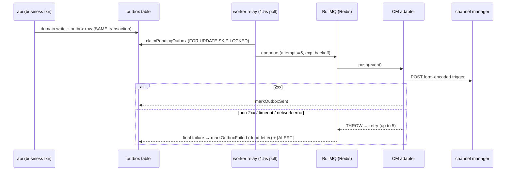

# YoHoBed 2.0 — Architecture

> How the platform is put together: the apps, the multi-tenancy model, the security layers, the
> channel-manager pipeline, and the four legacy bugs this design exists to make impossible.
>
> Companion docs: [API.md](API.md) · [DATA-MODEL.md](DATA-MODEL.md) · [PRICING.md](PRICING.md) ·
> [OPERATIONS.md](OPERATIONS.md)

## 1. System overview

```mermaid
flowchart LR
  subgraph Clients
    OWNER[Owner browser<br/>/app/*]
    STAFF[Staff browser<br/>/staff]
    GUEST[Guest browser<br/>/review/:token]
  end

  subgraph Web["apps/web-extranet (Next.js :3000)"]
    UI[Owner PMS · Staff console · Public pages]
  end

  subgraph Api["apps/api (NestJS :3001)"]
    GUARDS[JwtAuthGuard → TenantGuard → RolesGuard]
    MODULES[20 feature modules]
  end

  subgraph Data
    PG[(PostgreSQL 16<br/>RLS as yoho_app)]
    REDIS[(Redis 7<br/>BullMQ)]
    DISK[(MEDIA_DIR<br/>photo files)]
  end

  subgraph Worker["apps/worker (BullMQ)"]
    RELAY[outbox relay → cm-push queue]
    ADAPTER[CM adapter<br/>fake | axisrooms]
  end

  CM[Channel manager /<br/>core.yohobed.com]
  RESEND[Email provider<br/>console | Resend]

  OWNER & STAFF & GUEST --> UI
  UI -->|"fetch + Bearer JWT"| Api
  MODULES --> PG
  MODULES --> DISK
  MODULES -->|queued messages| RESEND
  MODULES -->|"outbox rows (same txn)"| PG
  RELAY --> PG
  RELAY --> REDIS
  REDIS --> ADAPTER
  ADAPTER -->|form-encoded triggers| CM
  CM -->|"POST /cm/reservations (x-cm-secret)"| Api
```

Three runtime processes plus infrastructure:

| Process             | What it is                                                                                                                                                                                                                           | Port |
| ------------------- | ------------------------------------------------------------------------------------------------------------------------------------------------------------------------------------------------------------------------------------ | ---- |
| `apps/api`          | NestJS modular monolith — all business logic, ~90 endpoints across 20 modules                                                                                                                                                        | 3001 |
| `apps/web-extranet` | Next.js 14 App Router — owner PMS, staff console, and public pages (login, register, password reset, guest review)                                                                                                                   | 3000 |
| `apps/worker`       | BullMQ worker — drains the transactional outbox to the channel manager, fetches daily FX rates                                                                                                                                       | —    |
| `apps/etl`          | One-shot legacy MySQL → Postgres migration + the parity cutover gate. Run by hand, never serving traffic; writes as the **owner** role because it crosses every tenant in one pass (see [apps/etl/README.md](../apps/etl/README.md)) | —    |
| Postgres 16         | All state; row-level security enforced on the app's role                                                                                                                                                                             | 5433 |
| Redis 7             | BullMQ queue backing                                                                                                                                                                                                                 | 6380 |

Shared packages: `@yohobed/domain` (framework-free money engine — see [PRICING.md](PRICING.md)),
`@yohobed/db` (Drizzle schema, migrations, RLS, DB helpers — see [DATA-MODEL.md](DATA-MODEL.md)),
`@yohobed/cm-adapter` (channel-manager adapters).

## 2. Multi-tenancy and the security model

A **tenant** is a property owner (the legacy `propertyowners`). Every tenant-owned row carries a
`tenant_id`. Isolation is enforced **twice**, independently:

1. **Application scope** — `withTenant(db, tenantId, fn)` opens a transaction and sets the
   Postgres session variable `app.tenant_id` LOCAL to it (`packages/db/src/scope.ts`).
2. **Postgres row-level security** — the API connects as the restricted `yoho_app` role. 33
   tables carry a `tenant_isolation` policy (`USING` + `WITH CHECK`
   `tenant_id = current_setting('app.tenant_id')`), applied by `packages/db/src/rls.sql`. With no
   tenant context set, those tables return **nothing** — so a query that forgets its `WHERE`
   clause cannot leak another tenant's rows.

Migrations and seeds run as the table owner (`postgres`), which bypasses RLS by design.

### Request lifecycle

```
Browser ──Bearer JWT──▶ JwtAuthGuard        verifies the token, attaches the principal
                        TenantGuard         resolves the active tenant from the x-tenant-id header
                                            or the user's single membership — and accepts it ONLY
                                            if it's in the caller's memberships. Also blocks
                                            suspended/inactive tenants per-request.
                        RolesGuard          (staff routes only) requires YOHO_STAFF / YOHO_ADMIN
                        service             runs inside withTenant(tenantId) → RLS in force
```

This closes the legacy holes: the client-supplied property id is never trusted (membership is
checked), and there is no hardcoded admin-email backdoor (staff access is a real role).

### The auth surfaces

| Surface                                           | Mechanism                                                                                       |
| ------------------------------------------------- | ----------------------------------------------------------------------------------------------- |
| Owner / staff API                                 | JWT (1d expiry) carrying `{ sub, email, memberships[] }`                                        |
| Channel-manager webhook (`POST /cm/reservations`) | Shared secret header `x-cm-secret` (`CM_WEBHOOK_SECRET`)                                        |
| Guest review submission                           | Single-use, unguessable 128-bit token minted at check-out — the token _is_ the authorization    |
| Photo serving (`GET /media/:key`)                 | Unguessable 128-bit storage key (a browser `` can't send a JWT); writes stay tenant-fenced |
| Password reset                                    | sha256-hashed token, 60-minute TTL, single-use                                                  |

Registration is self-serve and creates a **pending** tenant: the owner can sign in and set
everything up immediately, but YoHo staff must approve (staff console) before the account is
`active`. Suspended/inactive tenants are refused at login _and_ on every request.

### Tables deliberately without RLS

Documented in full in [DATA-MODEL.md](DATA-MODEL.md); the pattern matters architecturally.
`outbox` (the worker drains all tenants), `cm_room_mappings` (the webhook must resolve the tenant
_from_ the room code before any tenant context exists), and `review_invites` (a guest has no
tenant context; the token resolves it) are infrastructure routing tables — each is either
append-only, filtered in the service layer, or keyed by an unguessable token.

## 3. The channel-manager pipeline (transactional outbox)

The legacy platform pushed ARI (availability/rates/inventory) changes to the channel manager
fire-and-forget — a failed push was silently lost (legacy BUG #3). The rebuild makes loss
structurally impossible:



- **Outbound:** every ARI mutation (`availability open/close`, `reserve/release` from bookings,
  price set, last-minute drop, restrictions, promotion apply) calls `enqueueOutbox(tx, …)` inside
  the same transaction as the domain write. If the write rolls back, no phantom push; if it
  commits, the push cannot be forgotten. Payloads carry `propertyId`/`roomId` — the keys channel
  managers sync on.
- **Adapters** (`packages/cm-adapter`): `FakeCmAdapter` (dev/demo; `{__fail: true}` payloads force
  the failure path on demand), `AxisRoomsAdapter` (real — ports the legacy 5-endpoint contract of
  the in-house core service, PHP `key[]=` form encoding and all; throws on any failure). Selecting
  `axisrooms` without a URL refuses to boot rather than silently degrading to the fake.
- **Inbound:** the channel manager pushes reservations to `POST /cm/reservations`. Every push is
  recorded in `ota_reservations` **before** import is attempted, so a reservation can fail (no
  availability, no rates, unmapped room) but never vanish — failures stay in the owner's Inbox
  with the error and a Retry button. Imports run through the exact same booking path as a walk-in
  (atomic inventory, correct pricing key, safe reference, tax decomposition), arrive as source
  `OTA`, and are auto-approved (the guest already paid the OTA). Idempotent on
  `(channel, externalRef)`.

## 4. The four legacy bugs and their fixes

| #   | Legacy bug                                                                                    | Fix                                                                                                                                                                            | Where                                                             | Proof                                                          |
| --- | --------------------------------------------------------------------------------------------- | ------------------------------------------------------------------------------------------------------------------------------------------------------------------------------ | ----------------------------------------------------------------- | -------------------------------------------------------------- |
| 1   | **Overbooking race** — read-modify-write on inventory with no lock, floor, or transaction     | Atomic conditional `UPDATE … SET rooms_to_sell = rooms_to_sell − n WHERE … AND rooms_to_sell >= n`; 0 rows → rollback + 409. `CHECK (rooms_to_sell >= 0)` as a schema backstop | `packages/db/src/inventory.ts` (`reserveStay`)                    | e2e: 10 concurrent bookings for the last room → exactly 1 wins |
| 2   | **Walk-in priced on the wrong key** — `room_id` passed where `occupancy_rateplan_id` expected | Bookings carry an explicit `occupancyId`; create() verifies it belongs to the room and prices on it                                                                            | `apps/api/src/bookings/booking.service.ts`                        | e2e: occupancy from another room → 404                         |
| 3   | **Silent channel-sync failures** — fire-and-forget HTTP, response ignored                     | Transactional outbox + worker retry/backoff + dead-letter + `[ALERT]`; adapters THROW on failure                                                                               | `packages/db/src/outbox.ts`, `apps/worker`, `packages/cm-adapter` | Live-verified: core-service 500 → 5 retries → DLQ + alert      |
| 4   | **Booking-reference race** — `MAX(reference)+1`                                               | Atomic per-day counter (`INSERT … ON CONFLICT DO UPDATE … RETURNING`) + UNIQUE constraint; format `yymmdd` + 4-digit                                                           | `packages/db/src/bookings.ts` (`nextBookingReference`)            | e2e: 12 concurrent bookings → 12 unique references             |

## 5. Email

A provider seam, not a hard dependency (`apps/api/src/email/`):

- `EmailService` — `console` (logs instead of sending; dev default) or `resend` (HTTP API).
  `send()` never throws.
- `MailerService` — guest-facing messages are **queued as rows** in the `messages` table inside
  the business transaction, rendered from per-tenant templates (`renderTemplate`,
  `{{placeholder}}` substitution). After commit, `deliverQueuedSafe()` drains them: success →
  `sent`, provider failure → `failed` with the error, visible and retryable in the Comms screen.
  Email can be down; bookings still happen.

Sent this way: booking confirmations (walk-in + OTA import) and review invites (at check-out).
Sent directly (fire-and-forget, non-critical): registration-received, staff-approval welcome,
password-reset links.

Every new tenant gets a starter template set (`packages/db/src/default-templates.ts`) — the same
set the dev seed installs, provisioned at registration inside the same transaction.

## 6. Media

Photos upload to `LocalDiskStorage` (`MEDIA_DIR`, default `./uploads`) behind a `StorageAdapter`
seam (S3-compatible later). JPEG/PNG/WebP only, ≤ 5 MB. The `media` table is the source of truth;
files are stored under random hex keys, never the user's filename. Serving is public by
unguessable key with immutable cache headers; uploads/deletes are tenant-fenced.

## 7. Web app structure

- **Owner PMS** (`/app/*`): a fixed left sidebar shell — Dashboard, Calendar, Bookings, Inbox,
  Customers, Deals, Finance, Reviews, Comms, Setup, Profile — with a notifications bell (20s
  unread polling). A persistent amber banner shows while the tenant is `pending`.
- **Staff console** (`/staff`): separate layout; owners are redirected out, staff are redirected in.
- **Public**: login `/`, `/register`, `/forgot`, `/reset`, and the guest review form
  `/review/[token]`.
- All screens are client components calling the API with a Bearer token from `localStorage`
  (`lib/api.ts` is the single typed client).

### Design system

Indigo brand (`#4b45c6`) + teal accent; a **reserved status palette** used only for state —
green `avail` (open/approved/paid), amber `low` (pending/low/warning), red `closed`
(closed/sold-out/failed), blue `info` — each with `-ink` (text) and `-soft` (background)
variants, wired as CSS variables into Tailwind. Money is always displayed as **LKR**
(`Rs 24,390.25` — `lib/format.ts money()`); dates are `YYYY-MM-DD` UTC internally, `16 Jul 2026`
for display. Dark mode follows the OS (`prefers-color-scheme`), no in-app toggle. Numbers and
references render in a mono stack with tabular numerals.

## 8. Testing strategy

| Layer                      | Suite                                       | What it proves                                                                                                                                                    |
| -------------------------- | ------------------------------------------- | ----------------------------------------------------------------------------------------------------------------------------------------------------------------- |
| `packages/domain` (42)     | Pure unit                                   | Numeric parity with the legacy PHP formulas (IEEE-754 float behavior preserved on purpose)                                                                        |
| `packages/db` (8)          | Integration vs real Postgres                | RLS isolation (4 ways), overbooking atomicity, reference uniqueness under concurrency                                                                             |
| `apps/api` (36)            | e2e — real Nest app over HTTP as `yoho_app` | Auth/RBAC, tenant isolation at the API surface, all four legacy-bug regressions, lifecycle, restrictions, OTA webhook, finance reconciliation, reviews, customers |
| `packages/cm-adapter` (19) | Contract                                    | The exact AxisRooms wire format (endpoints, field names, PHP array encoding), failure-throws discipline                                                           |

The e2e harness (`apps/api/test/harness.ts`) boots the real `AppModule` (SWC transform —
Nest DI needs `emitDecoratorMetadata`) and provisions an isolated tenant per suite. CI
(`.github/workflows/ci.yml`) runs migrate → seed → typecheck → build → all suites → format check
against service containers on every push.

## 9. What is deliberately not here yet

ETL/cutover from the legacy MySQL, hosting/deploy, the AI Supplier Copilot (MCP seams are
designed in — domain services are framework-free and tenant-scoped so tools can wrap them), a
Seasons UI (API exists), owner-editable taxes/commission (staff-configured; displayed in
Finance), multi-currency. Tracked in [GAP-ANALYSIS.md](GAP-ANALYSIS.md).
