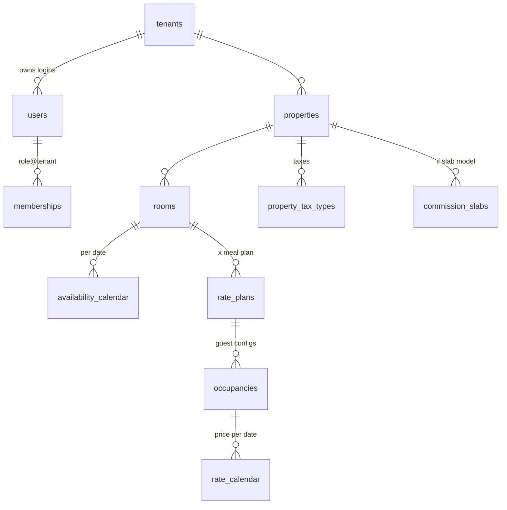
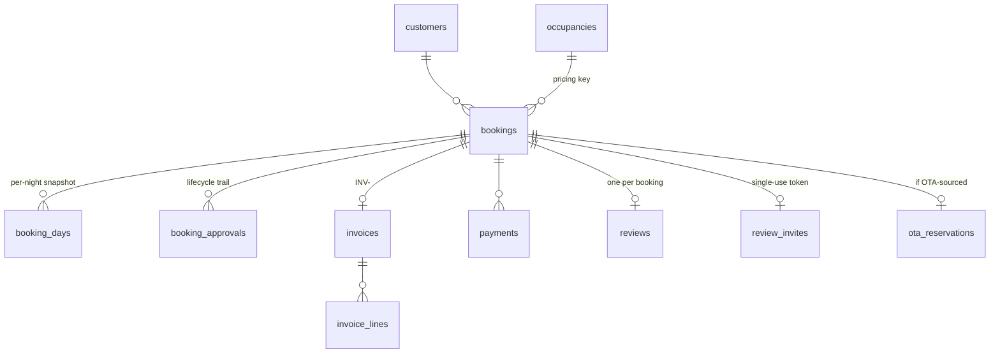

# YoHoBed 2.0 — Data Model

> Every table in `packages/db/src/schema/`, its purpose and key constraints, its row-level
> security status, the database helpers, the migration history, and what the dev seed creates.
>
> Companion docs: [ARCHITECTURE.md](ARCHITECTURE.md) (why RLS is shaped this way) ·
> [PRICING.md](PRICING.md) (how the numeric columns are computed)

**RLS legend:** ✅ = `tenant_isolation` policy (`tenant_id = current_setting('app.tenant_id')`,
USING + WITH CHECK, applied by `src/rls.sql`). ➖ = deliberately none, with the reason. Global
lookup/identity tables have no `tenant_id` and no policy.

## Core relationship chains

## Identity & tenancy (`schema/identity.ts`)

| Table             | RLS         | Purpose · key constraints                                                                                                                          |
| ----------------- | ----------- | -------------------------------------------------------------------------------------------------------------------------------------------------- |
| `tenants`         | ➖ registry | A property owner — the root of every ownership chain. Unique `email`; `status` enum `pending/active/inactive/suspended`; `agreement_accepted_at`.  |
| `users`           | ➖ registry | Login identity. Unique `email`; nullable `tenant_id` (null = cross-tenant YoHo staff); bcrypt `password_hash`.                                     |
| `memberships`     | ➖ registry | What a user may do, where. Role enum `OWNER/OWNER_STAFF/YOHO_STAFF/YOHO_ADMIN`; staff rows have `tenant_id = null`; unique `(user_id, tenant_id)`. |
| `sessions`        | ➖ registry | Opaque token hashes (reserved for refresh flows).                                                                                                  |
| `password_resets` | ➖ registry | sha256 token hashes + 60-min expiry.                                                                                                               |
| `properties`      | ✅          | A property. `commission_type` `percentage`\|`slab` + `commission_percentage` (default 10) — how the Yoho commission is derived.                    |

Identity tables are the tenancy _registry_ — they're what the guards consult to build the tenant
context, so they can't themselves sit behind it. Access is confined to auth/staff code paths.

## Inventory (`schema/inventory.ts`)

| Table                   | RLS | Purpose · key constraints                                                                                                                                                                                                                                                                       |
| ----------------------- | --- | ----------------------------------------------------------------------------------------------------------------------------------------------------------------------------------------------------------------------------------------------------------------------------------------------- |
| `roomtypes`             | ✅  | Per-tenant room category (Deluxe, Suite…).                                                                                                                                                                                                                                                      |
| `rooms`                 | ✅  | A sellable room type instance. `quantity` = physical count.                                                                                                                                                                                                                                     |
| `availability_calendar` | ✅  | **The single source of truth for sellable inventory.** Unique `(room_id, date)`; `physical_quantity`; `rooms_to_sell` with **`CHECK (rooms_to_sell >= 0)`** (the overbooking backstop); `status` Open/Close; `min_stay` (default 1) / `max_stay` (0 = unlimited) for arrival-date restrictions. |

## Rates & tax (`schema/rates.ts`, `schema/tax.ts`)

| Table                | RLS       | Purpose · key constraints                                                                                                                                   |
| -------------------- | --------- | ----------------------------------------------------------------------------------------------------------------------------------------------------------- |
| `rate_codes`         | ➖ global | Meal-plan lookup: RO/BB/HB/FB/AI. No tenant id.                                                                                                             |
| `rate_plans`         | ✅        | Room × meal plan. Status Active/Inactive.                                                                                                                   |
| `occupancies`        | ✅        | Guest configuration on a rate plan (label, accommodates) — **the pricing key every booking references** (legacy BUG #2 fix).                                |
| `rate_calendar`      | ✅        | Price per occupancy per date. Unique `(occupancy_id, date)`; `base_price`, `commission`, `selling_price` (always engine-derived), `last_minute_drop_pct`.   |
| `commission_slabs`   | ✅        | Slab bands for slab-commission properties (`slab_start`–`slab_end` → flat `commission`).                                                                    |
| `seasons`            | ✅        | Named date range for bulk price authoring (API only; no UI yet).                                                                                            |
| `tax_types`          | ✅        | A named tax (Service Charge, VAT…).                                                                                                                         |
| `tax_durations`      | ✅        | Time-bounded rate % for a tax type.                                                                                                                         |
| `property_tax_types` | ✅        | Property ↔ tax link with **`CHECK (priority IN (1,2,3))`** — 1 = service charge, 2 = NBT, 3 = VAT (the legacy nesting order; see [PRICING.md](PRICING.md)). |

## Bookings (`schema/bookings.ts`)

| Table               | RLS       | Purpose · key constraints                                                                                                                                                                                                                                                                                                                             |
| ------------------- | --------- | ----------------------------------------------------------------------------------------------------------------------------------------------------------------------------------------------------------------------------------------------------------------------------------------------------------------------------------------------------- |
| `customers`         | ✅        | A guest (reused by email across bookings).                                                                                                                                                                                                                                                                                                            |
| `bookings`          | ✅        | The booking. Unique `reference` (`yymmdd####`); explicit `occupancy_id`; status enum `Pending/Approved/Rejected/Cancelled/NoShow/CheckedIn/CheckedOut`; source `Extranet/OTA/Backend`; money columns `amount`, `total_base_price`, `taxes`, `commissionable_amount` (= amount − taxes), `discount`; `checked_in_at`/`checked_out_at`; currency `LKR`. |
| `booking_days`      | ✅        | **Per-night price snapshot at booking time** (base/selling/commission/tax) — the audit + settlement source, immune to later rate edits.                                                                                                                                                                                                               |
| `booking_approvals` | ✅        | Lifecycle audit trail (created/approved/rejected/cancelled/no_show/checked_in/checked_out/amended + reason + actor).                                                                                                                                                                                                                                  |
| `booking_counters`  | ➖ global | Per-day counter behind `nextBookingReference` — references are globally unique like legacy.                                                                                                                                                                                                                                                           |

## Commercial (`schema/commercial.ts`)

| Table                  | RLS | Purpose · key constraints                                                                                                          |
| ---------------------- | --- | ---------------------------------------------------------------------------------------------------------------------------------- |
| `promotions`           | ✅  | Discount campaign per property (%, window, min nights). Applying writes the discount into `rate_calendar.last_minute_drop_pct`.    |
| `coupons`              | ✅  | Guest discount codes. Unique `(tenant_id, code)`; type percentage/fixed; window; `max_uses`/`used_count`; optional property scope. |
| `coupon_redemptions`   | ✅  | One row per redemption (booking, amount).                                                                                          |
| `referral_partners`    | ✅  | Partner + unique code + commission %.                                                                                              |
| `referral_commissions` | ✅  | Earned commission per booking (pending/paid).                                                                                      |

## Finance (`schema/finance.ts`)

| Table           | RLS | Purpose · key constraints                                                                                            |
| --------------- | --- | -------------------------------------------------------------------------------------------------------------------- |
| `invoices`      | ✅  | `INV-<booking reference>`, unique number; status draft/issued/paid/void.                                             |
| `invoice_lines` | ✅  | One line per booking night × rooms.                                                                                  |
| `payments`      | ✅  | Received/sent money against a booking (method, reference).                                                           |
| `payouts`       | ✅  | Snapshotted settlement for a property + period: gross/base/yoho/ota/taxes/netPayable; status pending/scheduled/paid. |

## Communications (`schema/comms.ts`)

| Table           | RLS       | Purpose · key constraints                                                                                                                                                         |
| --------------- | --------- | --------------------------------------------------------------------------------------------------------------------------------------------------------------------------------- |
| `languages`     | ➖ global | Language lookup (en default, si, ta).                                                                                                                                             |
| `templates`     | ✅        | Per-tenant, per-language message templates with `{{placeholder}}` variables. Unique `(tenant_id, key, language)`. Every new tenant gets the starter set (`default-templates.ts`). |
| `notifications` | ✅        | In-app notifications (the bell): type, title, body, entity link, read flag.                                                                                                       |
| `messages`      | ✅        | The outbound email log: rendered subject/body, `status` queued/sent/failed + `error`. Queued in the business transaction; delivered post-commit by the mailer.                    |

## Distribution & OTA (`schema/distribution.ts`, `schema/ota.ts`)

| Table              | RLS                                          | Purpose · key constraints                                                                                                                                                                                                 |
| ------------------ | -------------------------------------------- | ------------------------------------------------------------------------------------------------------------------------------------------------------------------------------------------------------------------------- |
| `outbox`           | ➖ **worker drains all tenants**             | The transactional outbox (legacy BUG #3 fix): aggregate, event type, payload, status pending/processing/sent/failed, attempts/max (5), last error.                                                                        |
| `cm_room_mappings` | ➖ **webhook resolves tenant FROM the code** | Channel-manager room code → tenant/property/room. Unique `room_id`, unique `code`. Owner endpoints filter by tenant in the service layer.                                                                                 |
| `ota_reservations` | ✅                                           | Every reservation the channel manager ever pushed, and what became of it. Unique `(channel, external_ref)` (idempotency); status received/imported/failed/cancelled/ignored; raw payload jsonb; error text for the inbox. |

## Profile & media (`schema/profile.ts`)

| Table             | RLS                                 | Purpose · key constraints                                                                                                                                                                                              |
| ----------------- | ----------------------------------- | ---------------------------------------------------------------------------------------------------------------------------------------------------------------------------------------------------------------------- |
| `payout_accounts` | ✅                                  | The settlement payee (bank/branch/holder/account/SWIFT). Unique per tenant.                                                                                                                                            |
| `media`           | ✅ writes, **public SELECT policy** | Uploaded photos. Unique random `storage_key` (never the user's filename); the extra `media_public_read` SELECT policy lets `GET /media/:key` serve bytes without a tenant context — the 128-bit key is the protection. |

## CRM & audit (`schema/crm.ts`, `schema/audit.ts`)

| Table            | RLS                      | Purpose · key constraints                                                                                                                               |
| ---------------- | ------------------------ | ------------------------------------------------------------------------------------------------------------------------------------------------------- |
| `reviews`        | ✅                       | One guest review per booking (unique `booking_id`), rating 1–5 + comment.                                                                               |
| `review_invites` | ➖ **token IS the auth** | Single-use public review route. PK = a fresh random token (not the booking id); `used_at` burns it. A guest has no tenant context — the row carries it. |
| `ari_history`    | ✅                       | Owner-facing log of every availability/price/drop/restriction change: kind, date range, detail jsonb, actor email.                                      |
| `audit_log`      | ➖ staff-only reads      | Append-only staff-action trail (actor, action, entity, detail). Read exclusively through the role-gated staff console.                                  |

## Database helpers (`packages/db/src/`)

| Helper                                                                                                | Purpose                                                                                                                                                                                  |
| ----------------------------------------------------------------------------------------------------- | ---------------------------------------------------------------------------------------------------------------------------------------------------------------------------------------- |
| `withTenant(db, tenantId, fn)` (`scope.ts`)                                                           | Opens a transaction, sets `app.tenant_id` LOCAL, runs `fn` under RLS. The only sanctioned way services touch tenant data.                                                                |
| `setTenantContext(tx, tenantId)` (`scope.ts`)                                                         | Adopt a tenant context on an already-open transaction — for registration, which creates the tenant and its first fenced rows in one transaction. Satisfies RLS rather than bypassing it. |
| `reserveStay(tx, roomId, nights, rooms)` (`inventory.ts`)                                             | Per-night atomic conditional decrement; throws `InsufficientAvailabilityError` (whole txn rolls back). The BUG #1 fix.                                                                   |
| `releaseStay(…)` (`inventory.ts`)                                                                     | Returns inventory, capped at `physical_quantity`.                                                                                                                                        |
| `nextBookingReference(tx, day)` (`bookings.ts`)                                                       | Race-free `yymmdd####` reference via an atomic upsert counter. The BUG #4 fix.                                                                                                           |
| `enqueueOutbox / claimPendingOutbox / markOutboxSent·Retry·Failed / requeueStaleOutbox` (`outbox.ts`) | The transactional-outbox machinery (claim uses `FOR UPDATE SKIP LOCKED`; stale `processing` rows are rescued after 120 s).                                                               |
| `resolveTaxRatesForDates(tx, propertyId, dates)` (`tax.ts`)                                           | Per-date tax fractions `{serviceCharge, nbt, vat}` from the property's tax config (zeros when unconfigured).                                                                             |
| `defaultTemplates / seedDefaultTemplates` (`default-templates.ts`)                                    | The starter message templates — single source used by **both** the dev seed and `/auth/register`.                                                                                        |
| `createDb(url, opts)` (`client.ts`)                                                                   | postgres.js + Drizzle handle; `migrate.ts` applies migrations then `rls.sql`.                                                                                                            |

## Migrations (`packages/db/drizzle/`, applied in order by `db:migrate`)

| #    | What it added                                                                                |
| ---- | -------------------------------------------------------------------------------------------- |
| 0000 | Identity & tenancy: tenants, users, memberships, sessions, password_resets, properties       |
| 0001 | Inventory: rooms, availability_calendar (+ `rooms_to_sell >= 0` check)                       |
| 0002 | roomtypes + rooms.roomtype_id                                                                |
| 0003 | Rates: rate_codes, rate_plans, occupancies, rate_calendar + property commission columns      |
| 0004 | Bookings: customers, bookings, booking_days, booking_approvals, booking_counters             |
| 0005 | outbox (transactional CM queue)                                                              |
| 0006 | Finance: payments, invoices, invoice_lines, payouts                                          |
| 0007 | audit_log                                                                                    |
| 0008 | Tax parity: tax_types, tax_durations, property_tax_types, commission_slabs                   |
| 0009 | Rates depth: seasons, last_minute_drop_pct                                                   |
| 0010 | Commercial: promotions, coupons, coupon_redemptions, referral_partners, referral_commissions |
| 0011 | Comms: languages, templates, notifications, messages                                         |
| 0012 | OTA inbox: cm_room_mappings, ota_reservations                                                |
| 0013 | Front desk: CheckedIn/CheckedOut statuses + checked_in_at/out_at (+ `amended` trail action)  |
| 0014 | Onboarding: `pending` tenant status                                                          |
| 0015 | Email seam: messages.error                                                                   |
| 0016 | Compartment I: availability min_stay/max_stay, ari_history, reviews, review_invites          |

`db:migrate` finishes by (re)applying `rls.sql` — policies are idempotent (`DROP POLICY IF
EXISTS` + `CREATE`), so new tables added in a migration get fenced in the same run.

## The dev seed (`pnpm --filter @yohobed/db db:seed`)

Idempotent; runs as the table owner (bypasses RLS). Creates:

- **Logins** — owner `owner@demo.yohobed.test` / `password123` (tenant "Cinnamon Lakeside
  Group"); staff `staff@yohobed.test` / `password123` (cross-tenant `YOHO_STAFF`).
- **Property 1 — Cinnamon Lakeside** (percentage commission 10%, untaxed): room "Deluxe Room"
  ×5; 14 days of availability from 2026-08-01, with **2026-08-10 deliberately left at
  `rooms_to_sell = 1`** (the overbooking-race demo date); BB rate plan + "Double" occupancy;
  base Rs 18,000 weekday / 25,000 weekend priced through the engine.
- **Property 2 — Ceylon Tax Villa** (slab commission + 10% Service Charge + 15% VAT): room
  "Ocean Suite" ×3; slabs 0–20,000 → 2,500 and 20,000.01–100,000 → 4,000; a 15% last-minute drop
  on the first 3 nights; prints the reconciliation proof (see [PRICING.md](PRICING.md)).
- **Reference data** — rate codes RO/BB/HB/FB/AI; languages en/si/ta; the starter templates; CM
  room-code mappings `CM-DLX-001` (Deluxe) and `CM-OCN-101` (Ocean Suite).

> Note: the seed **resets the demo tenant's inventory** (delete-by-tenant) so it's deterministic —
> demo room/occupancy IDs change on every run. It never touches other tenants.
