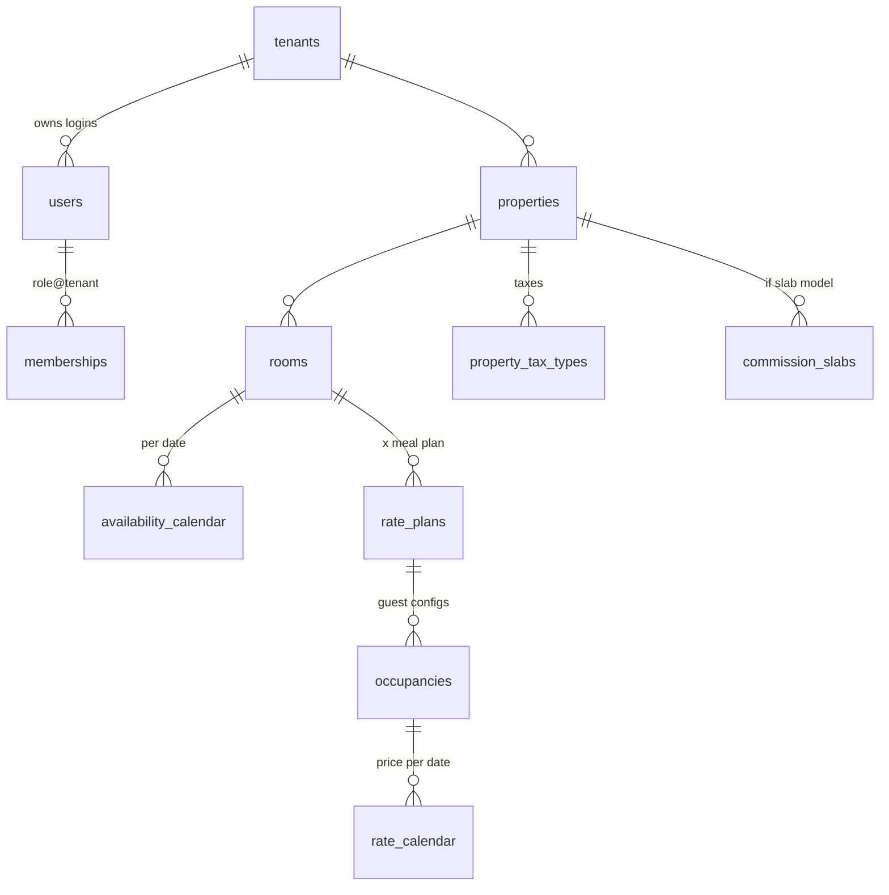
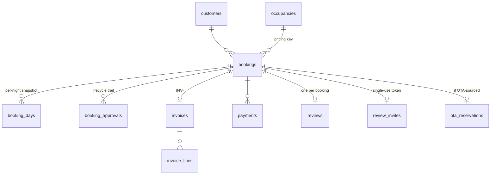

# YoHoBed 2.0 — Data Model

> Every table in `packages/db/src/schema/`, its purpose and key constraints, its row-level
> security status, the database helpers, the migration history, and what the dev seed creates.
>
> Companion docs: [ARCHITECTURE.md](ARCHITECTURE.md) (why RLS is shaped this way) ·
> [PRICING.md](PRICING.md) (how the numeric columns are computed)

**RLS legend:** ✅ = `tenant_isolation` policy (`tenant_id = current_setting('app.tenant_id')`,
USING + WITH CHECK, applied by `src/rls.sql`). ➖ = deliberately none, with the reason. Global
lookup/identity tables have no `tenant_id` and no policy.

## Core relationship chains





## Identity & tenancy (`schema/identity.ts`)

| Table             | RLS         | Purpose · key constraints                                                                                                                                                                                                                                                                                                                                                                                                                                                                                                                                                                                                                                                                                                                                                                                                                                             |
| ----------------- | ----------- | --------------------------------------------------------------------------------------------------------------------------------------------------------------------------------------------------------------------------------------------------------------------------------------------------------------------------------------------------------------------------------------------------------------------------------------------------------------------------------------------------------------------------------------------------------------------------------------------------------------------------------------------------------------------------------------------------------------------------------------------------------------------------------------------------------------------------------------------------------------------- |
| `tenants`         | ➖ registry | A property owner — the root of every ownership chain. Unique `email`; `status` enum `pending/active/inactive/suspended`; `agreement_accepted_at`.                                                                                                                                                                                                                                                                                                                                                                                                                                                                                                                                                                                                                                                                                                                     |
| `users`           | ➖ registry | Login identity. Unique `email`; nullable `tenant_id` (null = cross-tenant YoHo staff); bcrypt `password_hash`.                                                                                                                                                                                                                                                                                                                                                                                                                                                                                                                                                                                                                                                                                                                                                        |
| `memberships`     | ➖ registry | What a user may do, where. Role enum `OWNER/OWNER_STAFF/YOHO_STAFF/YOHO_ADMIN`; staff rows have `tenant_id = null`; unique `(user_id, tenant_id)`.                                                                                                                                                                                                                                                                                                                                                                                                                                                                                                                                                                                                                                                                                                                    |
| `sessions`        | ➖ registry | Opaque token hashes (reserved for refresh flows).                                                                                                                                                                                                                                                                                                                                                                                                                                                                                                                                                                                                                                                                                                                                                                                                                     |
| `password_resets` | ➖ registry | sha256 token hashes + 60-min expiry.                                                                                                                                                                                                                                                                                                                                                                                                                                                                                                                                                                                                                                                                                                                                                                                                                                  |
| `properties`      | ✅          | A property. `commission_type` `percentage`\|`slab` + `commission_percentage` (default 10) — how the Yoho commission is derived. Plus its identity & operating parameters: `code` (the number shown beside the name), address block (`address/city/state/country/zip`), `phone`, `email`, `timezone` (what night audit rolls the business date against), `checkin_time`/`checkout_time`, `star_rating`, `logo_media_id`. Regional identity (Phase 02): `country_code` (ISO alpha-2, default `LK`, CHECK shape, **locked once the property has bookings**), `state_code` (ISO for LK/MY, GST state code for IN), `legal_name`, `tax_ids` jsonb (`tin`, `ssclRegNo`, `sltdaRegNo`, `gstin`, `sstNo`, `ttxNo`, `brn`), `branch_code`, `fy_start_month` (1–12), `invoice_prefix`, and `settings` jsonb (reservation-desk settings, resolved by `resolvePropertySettings`). |

Identity tables are the tenancy _registry_ — they're what the guards consult to build the tenant
context, so they can't themselves sit behind it. Access is confined to auth/staff code paths.

`tenants.distribution_mode` (`yoho`\|`standalone`, default `yoho`) decides whether the platform
commission and payout chain apply at all. A `standalone` tenant bought the PMS as a subscription
and sells its own inventory. `RatesService.setPriceRange` gives it a zero commission
(`commissionStructureFor()`) and **no OTA gross-up**: its tax-exclusive price is the base price
exactly as entered. That base is not passed through `sellingPrice(base, 0, 0)`, whose round-up
step would add a cent to roughly one price in seventeen. (Before Phase 02 this was documented but
never wired, so standalone tenants were still grossed up.)

## Subscriptions & entitlements (`schema/billing.ts`)

| Table             | RLS          | Purpose · key constraints                                                                                                                                         |
| ----------------- | ------------ | ----------------------------------------------------------------------------------------------------------------------------------------------------------------- |
| `plans`           | ➖ catalogue | The sellable tiers. Unique `code`; `price_monthly` + `currency`; `features` jsonb holding a `PlanFeatures` document; `status` `active`\|`archived`; `sort_order`. |
| `subscriptions`   | ✅           | One row per tenant (unique `tenant_id`) — the tier they are on. `status` `trialing/active/past_due/cancelled`; period dates; `seats`.                             |
| `tenant_features` | ✅           | Per-tenant override on top of the plan, so support can grant one module off-plan. Unique `(tenant_id, key)`; `enabled`; `limit_value` for the numeric caps.       |

`plans` is deliberately un-fenced: it is a global product catalogue, identical for every tenant and
safe to read. Only staff may write it, which `RolesGuard` enforces at the API.

Resolution lives in `resolveEntitlements()` in `@yohobed/domain` — plan grants first, tenant
overrides on top, **deny-by-default** so a newly added feature key is never accidentally live for
existing subscribers. A cancelled or past-due subscription grants nothing. The API and the web app
share that one function so they cannot disagree about what a tenant bought.

## Inventory (`schema/inventory.ts`)

| Table                   | RLS | Purpose · key constraints                                                                                                                                                                                                                                                                       |
| ----------------------- | --- | ----------------------------------------------------------------------------------------------------------------------------------------------------------------------------------------------------------------------------------------------------------------------------------------------- |
| `roomtypes`             | ✅  | Per-tenant room category (Deluxe, Suite…).                                                                                                                                                                                                                                                      |
| `rooms`                 | ✅  | A sellable room type instance. `quantity` = physical count.                                                                                                                                                                                                                                     |
| `availability_calendar` | ✅  | **The single source of truth for sellable inventory.** Unique `(room_id, date)`; `physical_quantity`; `rooms_to_sell` with **`CHECK (rooms_to_sell >= 0)`** (the overbooking backstop); `status` Open/Close; `min_stay` (default 1) / `max_stay` (0 = unlimited) for arrival-date restrictions. |

### Buckets vs physical rooms

`rooms` is the **sellable bucket** — one row per room-type-per-property with a `quantity`. It is
what `availability_calendar`, `rate_plans`, `cm_room_mappings` and the outbox all speak, and none
of that changed when physical rooms arrived.

`room_units` sits beside it and answers what the bucket cannot: which actual room the guest is in.
That is the prerequisite for Stay View, Room View, room assignment and every housekeeping screen.

| Table                | RLS | Purpose · key constraints                                                                                                                                                    |
| -------------------- | --- | ---------------------------------------------------------------------------------------------------------------------------------------------------------------------------- |
| `room_units`         | ✅  | A physically identifiable room. Unique `(property_id, code)` — codes are property-wide, not per room type. `display_order`, `floor`, `notes`, `status` `active`\|`inactive`. |
| `maintenance_blocks` | ✅  | A room out of service (the hatched bar on the tape chart). `block_from`/`block_to` half-open, `reason`, `released_at`. Overlapping live blocks on one room are refused.      |

`SUM(active room_units) = rooms.quantity` is deliberately **not** a constraint — a unit taken out
of service must be allowed to make the two diverge. `GET /properties/:id/room-units/counts`
surfaces the difference as a setup warning instead.

## Housekeeping (`schema/housekeeping.ts`)

| Table                 | RLS | Purpose · key constraints                                                                                                                                                    |
| --------------------- | --- | ---------------------------------------------------------------------------------------------------------------------------------------------------------------------------- |
| `housekeeping_status` | ✅  | One row per room per **day**. Unique `(room_unit_id, date)`; status `dirty`/`clean`/`inspected`/`out_of_order`; `assigned_to_user_id`, `remarks`, `changed_at`/`changed_by`. |
| `work_orders`         | ✅  | A maintenance job. Nullable `room_unit_id` — plenty of jobs are the lobby or the lift. `priority`, `status`, `assigned_to_user_id`, `deadline`, `completed_at`.              |

The enum is named `housekeeping_state`, not `housekeeping_status`: Postgres gives every table an
implicit composite type of the same name, so an enum cannot share its table's name.

**A missing row means `clean`** — a room nobody has touched is not dirty. Rows are created lazily,
so a 200-room hotel does not accrue 73,000 rows a year for rooms that were never occupied. Keying
by date rather than holding one "current status" column keeps history, which is what "who cleaned
05 on the 12th" needs, and what night audit will roll forward.

`out_of_order` here and a `maintenance_blocks` row are deliberately separate. A block reserves
**dates** — it is what stops the room being assigned next week. This is the state of the room
**today**. A supervisor marking a room out of order at 9am must not silently cancel next month's
reservations.

### Room state is derived, never stored

`Vacant / ArrivingToday / Occupied / PendingCheckout / OutOfOrder` is always a function of the
reservations plus the housekeeping flag. Storing it would create a second source of truth that
drifts the moment a booking is amended.

One subtlety worth knowing: a guest departing **today** is excluded by the half-open stay overlap
(`checkout` is exclusive) but is still physically in the room until they leave. That is exactly
`PendingCheckout`, so it needs its own query rather than falling out of the overlap — the same
reason Stay View's due-out count is computed separately from the bars it draws.

## Folio — the guest bill (`schema/folio.ts`)

| Table                | RLS | Purpose · key constraints                                                                                                                                    |
| -------------------- | --- | ------------------------------------------------------------------------------------------------------------------------------------------------------------ |
| `folios`             | ✅  | A billing window on a booking. Unique `(booking_id, window)`; `label`, `status` `open`/`closed`/`void`; currency inherited from the booking, never chosen.   |
| `charge_particulars` | ✅  | The catalogue of chargeable items. Unique `(tenant_id, code)`; `default_price`, `tax_rate_pct`, `tax_inclusive`, `active`.                                   |
| `folio_charges`      | ✅  | One line on the bill. `net + tax = total`, always. `source` `room`/`manual`/`pos`; `posted_for` is the business date; `voided_at` reverses without deleting. |
| `folio_transfers`    | ✅  | An audit row per charge moved between windows — the split-bill trail.                                                                                        |

`payments` gains a nullable `folio_id`. Deliberately **not** a separate `folio_payments` table:
`payments` is already the record of what a guest paid, and a second one would be a second answer
to "is this settled?".

### Room charges are copied, never recomputed

Posting room charges reads the `booking_days` snapshot and copies it. The money engine already
decided what each night costs; a second calculation is a second answer waiting to disagree with
settlement. **The snapshot is per room per night**, so each line is multiplied by
`bookings.rooms` — which is why the posted lines sum to `bookings.amount` exactly. That equality
is asserted in `folio.e2e.test.ts` and is the load-bearing guarantee of the folio.

Posting is idempotent through a partial unique index:

```sql
CREATE UNIQUE INDEX folio_charges_room_night_uq
  ON folio_charges (folio_id, booking_date)
  WHERE (source = 'room' AND voided_at IS NULL);
```

Excluding voided rows is what lets a wrongly-posted night be reversed and re-posted, while still
making a double-post impossible.

Extras follow the room rate's convention: a **tax-inclusive** price has its tax decomposed out of
the total, so a bill never mixes tax-in and tax-on lines. Voiding stamps `voided_at` rather than
deleting — a bill that silently loses a line is worse than one showing a line was reversed, and
the guest's copy may already be printed.

## Cashiering (`schema/cashiering.ts`)

| Table              | RLS | Purpose · key constraints                                                                                                                                                                                                                                                                                                                                                                                                   |
| ------------------ | --- | --------------------------------------------------------------------------------------------------------------------------------------------------------------------------------------------------------------------------------------------------------------------------------------------------------------------------------------------------------------------------------------------------------------------------- |
| `ledger_accounts`  | ✅  | Travel agents, companies and sales people in **one** table — they differ only in what they are called. Unique `(tenant_id, code)`; `credit_limit` (0 = no limit). Phase 02 adds invoicing and agent-terms depth: `legal_name`, `country_code`, `state_code`, `city`, `zip`, `mobile`, `registration_no`, `commission_plan` (CHECK) + `commission_value`, `discount_pct`, `default_market_segment_id`, `payment_terms_days`. |
| `ledger_entries`   | ✅  | The running account. `debit` increases what they owe us, `credit` is money received.                                                                                                                                                                                                                                                                                                                                        |
| `business_sources` | ✅  | Where the business came from. Phase 02 adds `category` (`direct/ota/travel_agent/corporate` — Yanolja's Booking Source), `palette` (a `TAG_COLORS` key; the legacy hex `color` stays for old readers), `default_market_segment_id`, `commission_plan` + `commission_value`, `registration_no`, `collects_tourism_tax`, `sort`.                                                                                              |
| `cash_drawers`     | ✅  | A physical till. A property may run several.                                                                                                                                                                                                                                                                                                                                                                                |
| `drawer_sessions`  | ✅  | One cashier's shift. Partial unique index allows only **one open shift per drawer**.                                                                                                                                                                                                                                                                                                                                        |
| `expense_vouchers` | ✅  | Money out of the till. Unique `(property_id, voucher_no)`.                                                                                                                                                                                                                                                                                                                                                                  |

`payments` gains `drawer_session_id` (which shift took it) and `ledger_account_id` (set when the
payment is a transfer to the city ledger rather than money arriving). `bookings` gains
`business_source_id` and `ledger_account_id`.

**Balances are never stored.** A stored balance and its entries are two answers to the same
question, and they drift the first time anything is back-dated.

**Only cash counts toward a drawer.** A card payment never entered the till, so including card
takings would make every shift look short by the day's card revenue. The variance is computed at
close and **frozen** on the row — recomputing it later would quietly rewrite history the moment a
back-dated payment landed on the shift.

`ledger_accounts` is not `referral_partners`: a referrer _earns_ commission from us, a ledger
account _owes_ us money.

## Reservation configuration (`schema/configuration.ts`, Development Phase 02)

| Table             | RLS | Purpose · key constraints                                                                                                                                                                                                                                                                                         |
| ----------------- | --- | ----------------------------------------------------------------------------------------------------------------------------------------------------------------------------------------------------------------------------------------------------------------------------------------------------------------- |
| `market_segments` | ✅  | Why the guest is staying. Unique `(tenant_id, code)`; `grp` CHECK `transient/group/contract/non_revenue`; `palette`; `excluded_from_sold` (complimentary and house use stay out of rooms sold); `sort`; `active`.                                                                                                 |
| `payment_methods` | ✅  | The Payment Mode list. Unique `(tenant_id, code)`; `category` CHECK `cash/card/bank_transfer/qr/wallet/cheque/city_ledger/online/other`; `requires_reference`; `is_default_cash` (one per tenant, enforced by the service); `is_guest_advance`; `currency` (foreign cash); `property_id` (null = all properties). |

**Vocabularies are CHECK-constrained text, not Postgres enums.** A value added to an enum cannot
be used in the same migration run (Drizzle applies every pending migration in one transaction),
and these lists are expected to grow.

**Seeded once per tenant.** `seedDefaultMasters` copies the country preset (`@yohobed/locale`)
into a tenant only if it has no market segments yet. It runs from `db:migrate` for existing
tenants, from registration, and from the e2e fixture. After that the lists belong to the owner:
entries are deactivated, never deleted, and re-running a migration never brings back an entry the
owner renamed. `applyRegionPreset` adds another country's missing codes on request.

## Night audit (`schema/nightaudit.ts`)

| Table              | RLS | Purpose · key constraints                                                                                  |
| ------------------ | --- | ---------------------------------------------------------------------------------------------------------- |
| `business_dates`   | ✅  | The property's business date. Unique per property — a chain across time zones legitimately differs.        |
| `night_audit_runs` | ✅  | One run: dates closed and rolled to, counts, totals, `summary` jsonb, and the user **and IP** that ran it. |

**The business date is not today's date.** A hotel's day ends when the night auditor says it does,
often at 3am, so a charge posted at 01:30 belongs to the previous business day. Every posting and
report keys off `business_dates` rather than `current_date` — that is the difference between a
report that reconciles and one that does not.

The run is one transaction: post the night's room charges, no-show what never arrived, force-close
any open till, roll the date. A half-run audit — charges posted but the date not moved — would
double-post on the next attempt.

**Nights already billed by hand are looked up and skipped, not caught.** Inserting and catching the
unique violation does not work: in Postgres an error aborts the whole transaction, so every later
statement fails even though the error was "handled". The totals are frozen in `summary` for the
same reason the drawer variance is.

## Rates & tax (`schema/rates.ts`, `schema/tax.ts`)

| Table                | RLS       | Purpose · key constraints                                                                                                                                   |
| -------------------- | --------- | ----------------------------------------------------------------------------------------------------------------------------------------------------------- |
| `rate_codes`         | ➖ global | Meal-plan lookup: RO/BB/HB/FB/AI. No tenant id.                                                                                                             |
| `rate_plans`         | ✅        | Room × meal plan. Status Active/Inactive.                                                                                                                   |
| `occupancies`        | ✅        | Guest configuration on a rate plan (label, accommodates) — **the pricing key every booking references** (legacy BUG #2 fix).                                |
| `rate_calendar`      | ✅        | Price per occupancy per date. Unique `(occupancy_id, date)`; `base_price`, `commission`, `selling_price` (always engine-derived), `last_minute_drop_pct`.   |
| `commission_slabs`   | ✅        | Slab bands for slab-commission properties (`slab_start`–`slab_end` → flat `commission`).                                                                    |
| `seasons`            | ✅        | Named date range for bulk price authoring (API only; no UI yet).                                                                                            |
| `tax_types`          | ✅        | A named tax (Service Charge, VAT…).                                                                                                                         |
| `tax_durations`      | ✅        | Time-bounded rate % for a tax type.                                                                                                                         |
| `property_tax_types` | ✅        | Property ↔ tax link with **`CHECK (priority IN (1,2,3))`** — 1 = service charge, 2 = NBT, 3 = VAT (the legacy nesting order; see [PRICING.md](PRICING.md)). |

## Bookings (`schema/bookings.ts`)

| Table               | RLS       | Purpose · key constraints                                                                                                                                                                                                                                                                                                                             |
| ------------------- | --------- | ----------------------------------------------------------------------------------------------------------------------------------------------------------------------------------------------------------------------------------------------------------------------------------------------------------------------------------------------------- |
| `customers`         | ✅        | A guest (reused by email across bookings).                                                                                                                                                                                                                                                                                                            |
| `bookings`          | ✅        | The booking. Unique `reference` (`yymmdd####`); explicit `occupancy_id`; status enum `Pending/Approved/Rejected/Cancelled/NoShow/CheckedIn/CheckedOut`; source `Extranet/OTA/Backend`; money columns `amount`, `total_base_price`, `taxes`, `commissionable_amount` (= amount − taxes), `discount`; `checked_in_at`/`checked_out_at`; currency `LKR`. |
| `booking_days`      | ✅        | **Per-night price snapshot at booking time** (base/selling/commission/tax) — the audit + settlement source, immune to later rate edits.                                                                                                                                                                                                               |
| `booking_approvals` | ✅        | Lifecycle audit trail (created/approved/rejected/cancelled/no_show/checked_in/checked_out/amended + reason + actor).                                                                                                                                                                                                                                  |
| `booking_counters`  | ➖ global | Per-day counter behind `nextBookingReference` — references are globally unique like legacy.                                                                                                                                                                                                                                                           |
| `booking_rooms`     | ✅        | **One leg per physical room** — what a tape-chart bar actually is. Nullable `room_unit_id` (unassigned), `leg_index` unique per booking, denormalised `checkin`/`checkout`, `adults`/`children`, `released_at`.                                                                                                                                       |
| `booking_groups`    | ✅        | Sibling reservations under one Group ID (Yanolja's `3359-1` / `3359-2`). Purely presentational — it never merges the money.                                                                                                                                                                                                                           |

### Why legs, and why the money stays on the booking

A booking with `rooms = 3` gets three `booking_rooms` legs. Money remains entirely on `bookings`
and `booking_days`, so **`@yohobed/domain` is untouched** by physical rooms — a leg only records
where the guests sleep. Yanolja instead splits a multi-room booking into sibling reservations
under a Group ID; `booking_groups` reproduces that presentation without splitting the money.

**Double-booking a physical room is structurally impossible**, the same way `rooms_to_sell >= 0`
makes overselling a bucket impossible:

```sql
EXCLUDE USING gist (room_unit_id WITH =, daterange(checkin, checkout, '[)') WITH &&)
  WHERE (room_unit_id IS NOT NULL AND released_at IS NULL)
```

Three consequences worth knowing. Ranges are **half-open**, so a same-day turnover (one guest out,
the next in) is allowed rather than flagged as a clash. **Unassigned** legs hold no room, so any
number may coexist. And cancelling stamps `released_at` rather than nulling `room_unit_id` — the
room is freed for re-sale while "which room was that cancellation in?" stays answerable.
`NoShow` deliberately does **not** release: the room was held for a guest who never arrived.

## Commercial (`schema/commercial.ts`)

| Table                  | RLS | Purpose · key constraints                                                                                                          |
| ---------------------- | --- | ---------------------------------------------------------------------------------------------------------------------------------- |
| `promotions`           | ✅  | Discount campaign per property (%, window, min nights). Applying writes the discount into `rate_calendar.last_minute_drop_pct`.    |
| `coupons`              | ✅  | Guest discount codes. Unique `(tenant_id, code)`; type percentage/fixed; window; `max_uses`/`used_count`; optional property scope. |
| `coupon_redemptions`   | ✅  | One row per redemption (booking, amount).                                                                                          |
| `referral_partners`    | ✅  | Partner + unique code + commission %.                                                                                              |
| `referral_commissions` | ✅  | Earned commission per booking (pending/paid).                                                                                      |

## Finance (`schema/finance.ts`)

| Table           | RLS | Purpose · key constraints                                                                                                                                                                                 |
| --------------- | --- | --------------------------------------------------------------------------------------------------------------------------------------------------------------------------------------------------------- |
| `invoices`      | ✅  | `INV-<booking reference>`, unique number; status draft/issued/paid/void; `currency` inherited from the booking.                                                                                           |
| `invoice_lines` | ✅  | One line per booking night × rooms.                                                                                                                                                                       |
| `payments`      | ✅  | Received/sent money against a booking (method, reference). `currency` is inherited from the booking, never chosen per payment — the settled-in-full check only totals payments sharing that denomination. |
| `payouts`       | ✅  | Snapshotted settlement for a property + period: gross/base/yoho/ota/taxes/netPayable; status pending/scheduled/paid; `currency` = the property's base currency (a settlement is never FX-converted).      |

## Communications (`schema/comms.ts`)

| Table           | RLS       | Purpose · key constraints                                                                                                                                                         |
| --------------- | --------- | --------------------------------------------------------------------------------------------------------------------------------------------------------------------------------- |
| `languages`     | ➖ global | Language lookup (en default, si, ta).                                                                                                                                             |
| `templates`     | ✅        | Per-tenant, per-language message templates with `{{placeholder}}` variables. Unique `(tenant_id, key, language)`. Every new tenant gets the starter set (`default-templates.ts`). |
| `notifications` | ✅        | In-app notifications (the bell): type, title, body, entity link, read flag.                                                                                                       |
| `messages`      | ✅        | The outbound email log: rendered subject/body, `status` queued/sent/failed + `error`. Queued in the business transaction; delivered post-commit by the mailer.                    |

## Distribution & OTA (`schema/distribution.ts`, `schema/ota.ts`)

| Table              | RLS                                          | Purpose · key constraints                                                                                                                                                                                                 |
| ------------------ | -------------------------------------------- | ------------------------------------------------------------------------------------------------------------------------------------------------------------------------------------------------------------------------- |
| `outbox`           | ➖ **worker drains all tenants**             | The transactional outbox (legacy BUG #3 fix): aggregate, event type, payload, status pending/processing/sent/failed, attempts/max (5), last error.                                                                        |
| `cm_room_mappings` | ➖ **webhook resolves tenant FROM the code** | Channel-manager room code → tenant/property/room. Unique `room_id`, unique `code`. Owner endpoints filter by tenant in the service layer.                                                                                 |
| `ota_reservations` | ✅                                           | Every reservation the channel manager ever pushed, and what became of it. Unique `(channel, external_ref)` (idempotency); status received/imported/failed/cancelled/ignored; raw payload jsonb; error text for the inbox. |

## Profile & media (`schema/profile.ts`)

| Table             | RLS                                 | Purpose · key constraints                                                                                                                                                                                              |
| ----------------- | ----------------------------------- | ---------------------------------------------------------------------------------------------------------------------------------------------------------------------------------------------------------------------- |
| `payout_accounts` | ✅                                  | The settlement payee (bank/branch/holder/account/SWIFT). Unique per tenant.                                                                                                                                            |
| `media`           | ✅ writes, **public SELECT policy** | Uploaded photos. Unique random `storage_key` (never the user's filename); the extra `media_public_read` SELECT policy lets `GET /media/:key` serve bytes without a tenant context — the 128-bit key is the protection. |

## CRM & audit (`schema/crm.ts`, `schema/audit.ts`)

| Table            | RLS                      | Purpose · key constraints                                                                                                                               |
| ---------------- | ------------------------ | ------------------------------------------------------------------------------------------------------------------------------------------------------- |
| `reviews`        | ✅                       | One guest review per booking (unique `booking_id`), rating 1–5 + comment.                                                                               |
| `review_invites` | ➖ **token IS the auth** | Single-use public review route. PK = a fresh random token (not the booking id); `used_at` burns it. A guest has no tenant context — the row carries it. |
| `ari_history`    | ✅                       | Owner-facing log of every availability/price/drop/restriction change: kind, date range, detail jsonb, actor email.                                      |
| `audit_log`      | ➖ staff-only reads      | Append-only staff-action trail (actor, action, entity, detail). Read exclusively through the role-gated staff console.                                  |

## Database helpers (`packages/db/src/`)

| Helper                                                                                                | Purpose                                                                                                                                                                                  |
| ----------------------------------------------------------------------------------------------------- | ---------------------------------------------------------------------------------------------------------------------------------------------------------------------------------------- |
| `withTenant(db, tenantId, fn)` (`scope.ts`)                                                           | Opens a transaction, sets `app.tenant_id` LOCAL, runs `fn` under RLS. The only sanctioned way services touch tenant data.                                                                |
| `setTenantContext(tx, tenantId)` (`scope.ts`)                                                         | Adopt a tenant context on an already-open transaction — for registration, which creates the tenant and its first fenced rows in one transaction. Satisfies RLS rather than bypassing it. |
| `reserveStay(tx, roomId, nights, rooms)` (`inventory.ts`)                                             | Per-night atomic conditional decrement; throws `InsufficientAvailabilityError` (whole txn rolls back). The BUG #1 fix.                                                                   |
| `releaseStay(…)` (`inventory.ts`)                                                                     | Returns inventory, capped at `physical_quantity`.                                                                                                                                        |
| `nextBookingReference(tx, day)` (`bookings.ts`)                                                       | Race-free `yymmdd####` reference via an atomic upsert counter. The BUG #4 fix.                                                                                                           |
| `enqueueOutbox / claimPendingOutbox / markOutboxSent·Retry·Failed / requeueStaleOutbox` (`outbox.ts`) | The transactional-outbox machinery (claim uses `FOR UPDATE SKIP LOCKED`; stale `processing` rows are rescued after 120 s).                                                               |
| `resolveTaxRatesForDates(tx, propertyId, dates)` (`tax.ts`)                                           | Per-date tax fractions `{serviceCharge, nbt, vat}` from the property's tax config (zeros when unconfigured).                                                                             |
| `defaultTemplates / seedDefaultTemplates` (`default-templates.ts`)                                    | The starter message templates — single source used by **both** the dev seed and `/auth/register`.                                                                                        |
| `seedDefaultMasters / applyRegionPreset` (`masters.ts`)                                               | The reservation master lists from the country preset — seeded once per tenant (migration, registration, fixture); `applyRegionPreset` adds a preset's missing codes only.                |
| `createDb(url, opts)` (`client.ts`)                                                                   | postgres.js + Drizzle handle; `migrate.ts` applies migrations then `rls.sql`.                                                                                                            |

## Migrations (`packages/db/drizzle/`, applied in order by `db:migrate`)

| #    | What it added                                                                                           |
| ---- | ------------------------------------------------------------------------------------------------------- |
| 0000 | Identity & tenancy: tenants, users, memberships, sessions, password_resets, properties                  |
| 0001 | Inventory: rooms, availability_calendar (+ `rooms_to_sell >= 0` check)                                  |
| 0002 | roomtypes + rooms.roomtype_id                                                                           |
| 0003 | Rates: rate_codes, rate_plans, occupancies, rate_calendar + property commission columns                 |
| 0004 | Bookings: customers, bookings, booking_days, booking_approvals, booking_counters                        |
| 0005 | outbox (transactional CM queue)                                                                         |
| 0006 | Finance: payments, invoices, invoice_lines, payouts                                                     |
| 0007 | audit_log                                                                                               |
| 0008 | Tax parity: tax_types, tax_durations, property_tax_types, commission_slabs                              |
| 0009 | Rates depth: seasons, last_minute_drop_pct                                                              |
| 0010 | Commercial: promotions, coupons, coupon_redemptions, referral_partners, referral_commissions            |
| 0011 | Comms: languages, templates, notifications, messages                                                    |
| 0012 | OTA inbox: cm_room_mappings, ota_reservations                                                           |
| 0013 | Front desk: CheckedIn/CheckedOut statuses + checked_in_at/out_at (+ `amended` trail action)             |
| 0014 | Onboarding: `pending` tenant status                                                                     |
| 0015 | Email seam: messages.error                                                                              |
| 0016 | Compartment I: availability min_stay/max_stay, ari_history, reviews, review_invites                     |
| 0017 | Multi-currency: properties.currency, bookings.fx_rate_to_lkr, exchange_rates                            |
| 0018 | Multi-currency: payments.currency, payouts.currency                                                     |
| 0019 | SaaS: plans, subscriptions, tenant_features, tenants.distribution_mode, property detail cols            |
| 0020 | Room units: room_units, booking_rooms, booking_groups, maintenance_blocks + back-fill                   |
| 0021 | Housekeeping: housekeeping_status, work_orders + guest-depth columns on customers                       |
| 0022 | Data-only: grandfathers every existing tenant onto an enterprise subscription                           |
| 0023 | Folio: folios, charge_particulars, folio_charges, folio_transfers, payments.folio_id                    |
| 0024 | Cashiering: ledger accounts/entries, business sources, drawers, expenses                                |
| 0025 | Night audit: business_dates, night_audit_runs                                                           |
| 0026 | Audit hardening: night-audit run index, room-line night check, group code index, `sending`              |
| 0027 | Phase 02: market_segments, payment_methods, property regional identity + settings, source/account depth |

`db:migrate` finishes by (re)applying `rls.sql` — policies are idempotent (`DROP POLICY IF
EXISTS` + `CREATE`), so new tables added in a migration get fenced in the same run.

## The dev seed (`pnpm --filter @yohobed/db db:seed`)

Idempotent; runs as the table owner (bypasses RLS). Creates:

- **Logins** — owner `owner@demo.yohobed.test` / `password123` (tenant "Cinnamon Lakeside
  Group"); staff `staff@yohobed.test` / `password123` (cross-tenant `YOHO_STAFF`).
- **Property 1 — Cinnamon Lakeside** (percentage commission 10%, untaxed): room "Deluxe Room"
  ×5; 14 days of availability from 2026-08-01, with **2026-08-10 deliberately left at
  `rooms_to_sell = 1`** (the overbooking-race demo date); BB rate plan + "Double" occupancy;
  base Rs 18,000 weekday / 25,000 weekend priced through the engine.
- **Property 2 — Ceylon Tax Villa** (slab commission + 10% Service Charge + 15% VAT): room
  "Ocean Suite" ×3; slabs 0–20,000 → 2,500 and 20,000.01–100,000 → 4,000; a 15% last-minute drop
  on the first 3 nights; prints the reconciliation proof (see [PRICING.md](PRICING.md)).
- **Reference data** — rate codes RO/BB/HB/FB/AI; languages en/si/ta; the starter templates; CM
  room-code mappings `CM-DLX-001` (Deluxe) and `CM-OCN-101` (Ocean Suite).

> Note: the seed **resets the demo tenant's inventory** (delete-by-tenant) so it's deterministic —
> demo room/occupancy IDs change on every run. It never touches other tenants.
